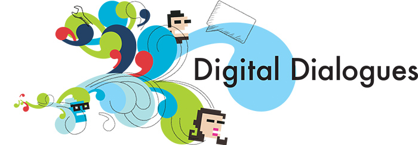

MITH is accepting nominations for potential speakers for our Digital Dialogues series in the Spring 2017 semester. Digital Dialogues is MITH’s signature events program, held almost every week while the academic semester is in session. Digital Dialogues is an occasion for discussion, presentation, and intellectual exchange that you can build into your weekly schedule.

To see a list of previous speakers, [see our past dialogue schedules](http://mith.umd.edu/digital-dialogues/past-dialogue-schedules/).

Nominations should be submitted by 5:00 pm on Friday, December 9. [Click here to submit your nominations](https://goo.gl/forms/uVuBUvXDAJdxPjo13).