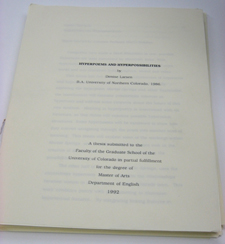

My previous posts on _The Deena Larsen Collection_ (_DLC_) focused on visiting the Maryland Institute for Technology in the Humanities (MITH) in person and interacting with the collection physically. While at MITH I read through early versions of the poems in _Marble Springs_, I loaded 20-year-old diskettes into a 20-year-old computer (and crossed my fingers), and looked through a box of newly-received-but-as-yet-uncataloged materials. As it is not always convenient to drive 700 miles to visit MITH (although I am planning another such trip as I write this), it would be nice to have access to the collection from a distance. My first interaction with the _DLC_, as it will likely be for most of you, was electronic, rather than physical, through _The Deena Larsen Collection _[website](http://mith.umd.edu/research/deena-larsen-collection/ "Deena Larsen Collection"), designed by Amanda Visconti (whom I follow on Twitter [@literature_geek](https://twitter.com/Literature_Geek)).

The _DLC \_site has more detail about how the collection came to MITH, and Larsen’s artist statement. Another page is devoted to Larsen’s important work \_Marble Springs_. The page includes a video of _Marble Springs_ running on modern computing equipment via an emulator program. The bulk of the site, though, is given over to a growing catalog of the collection. At this writing there are 114 photos of _DLC_ contents, including the [Mac Classic II Cozy](http://mith.umd.edu/larsen/items/show/41), the previously mentioned [shower curtain](http://mith.umd.edu/larsen/items/show/42) (below), and a cover shot of Brendon Towle’s paper "[Towards a Prescriptive Theory of Hypertext Fiction](http://mith.umd.edu/larsen/items/show/153)".

The on-line catalog is great, giving a sense of what the collection contains. However, I will admit to feeling teased by it, like a kid outside a candy shop with a closed sign hanging in the window.

The fact that the catalog represents a fairly small portion of collection has everything to do with resources. “We don’t have the institutional resources,” MITH Associate Director Matthew Kirschenbaum notes. At this point, Kirschenbaum is the only MITH staffer assigned to the _DLC_, and they are currently without an intern.

Further, Kirschenbaum, while he would like to begin digitizing items in the collection, pointed out some of challenges to fully digitizing the contents. In good archival practice, items need to have full metadata applied. Then, the collection is not limited to Larsen’s output, so there are concerns over intellectual property and copyrights. And while we can create digital representations of textual documents easily (given the time), the collections more interesting electronic literature pieces present complex problems. Should we try to emulate or migrate _Marble Springs_ and other hypertexts (if we can get permission)?

Finally, I asked Kirschenbaum about separating the intellectual content of the work from the physical artifact. “My own intellectual training,” he answered, “and my convictions are that the materiality of the artifact is essential to its identity, and one should not separate those things. I think Marble Springs is a particularly powerful example of that because Deena I think had very clearly a sense of the computer itself as part of the environment of the work.” Kirschenbaum went on to say that it still may be useful to try to migrate works like _Marble Springs_, into perhaps HTML, if we can maintain the primary functionality, but that would depend on audience need. “I don't think you can be a fundamentalist about those things,” he added.

So while there are significant difficulties to full digitization of _The Deena Larsen Collection_, there are a few steps that could be taken in the short term, to give distant researchers greater access. Papers, such as Larsen’s 1992 Thesis, _Hyperpoems and Hyperpossibilites _(below), could be scanned and made available to read on-line or via download. Currently, the catalog has a picture of the cover page, and a few interior pages. Making the thesis digital would give hypertext researchers an interesting pre-World Wide Web view.

As the collection contains hundreds of articles about computers and the development of Web culture, a linked bibliography of Larsen’s clippings could be created. Such a bibliography could help to contextualize Larsen’s thoughts on, and practice in, hypertextual works with the wider computer culture. Further, it could be a useful tool for researchers.

Larsen attended a number of conferences over the past two decades, collecting conference materials. Perhaps MITH could work out an arrangement to share links with the organizations that sponsored the conferences and the _DLC_, perhaps attracting more traffic and interest to the collection.

The \_DLC \_could also produce some original works based on items in the collection. Larsen met hundreds of people, and apparently was an avid business card swapper, as stacks and stacks of them are now in the collection. A visualization of e-literature, hypertextuality, and computer social networks based on these cards could be revealing…or just neat to look at.

There is a great potential for making certain aspects of _The Deena Larsen Collection_ available electronically rather easily, given time and human resources (not a given). There are also sizable challenges to making the most interesting parts of the collection available via the web; some technological in nature, others legal. Since the _DLC_ staff would like to make more materials available to researchers, hopefully resources can be found to do so. Hopefully too, as its curators see the DLC as a research test bed, the work of researchers utilizing the collection can address some of these challenges, and the output can be incorporated into _The Deena Larsen Collection_.

_The Deena Larsen Collection \_is nearly as much about the hypertext community of the late Twentieth Century as it is about the works of Deena Larsen herself. It will likely need to be a community effort to expand the reach of \_The Deena Larsen Collection._

\_\_\_\_\_\_\_\_\_\_\_\_\_\_\_\_\_\_\_\_\_\_\_\_\_\_\_\_\_\_\_\_\_\_\_\_\_\_\_\_\_\_\_\_\_\_\_

I would like to thank Matthew Kirschenbaum and all the folks at MITH for the opportunity to post on a collection to which I feel such a deep connection.

I would also like to thank Deena Larsen for her encouragement as I study her work.

\_\_\_\_\_\_\_\_\_\_\_\_\_\_\_\_\_\_\_\_\_\_\_\_\_\_\_\_\_\_\_\_\_\_\_\_\_\_\_\_\_\_\_\_\_\_\_

Want to schedule a visit to the _DLC_? Use the form at <http://mith.umd.edu/larsen/contact>

Citations:

Quotations from MITH Associate Director Matthew Kirschenbaum are from an interview with the author conducted April 15, 2011, at MITH, unless otherwise noted.

Image credits:

_The Deena Larsen Collection Web site_. Maryland Institute for Technology in the Humanities. <http://mith.umd.edu/larsen/>

Deena Larsen, "Marble Springs Shower Curtain," in The Deena Larsen Collection at the Maryland Institute for Technology in the Humanities, Item #42, <http://mith.umd.edu/larsen/items/show/42> (accessed May 10, 2011)

Deena Larsen, ""Hyperpoems and Hyperpossibilities": Deena Larsen's M.A. Thesis," in The Deena Larsen Collection at the Maryland Institute for Technology in the Humanities, Item #161, <http://mith.umd.edu/larsen/items/show/161> (accessed May 17, 2011).

Leighton Christiansen is pursing his Master’s of Library and Information Science Degree at the Graduate School of Library and Information Science (GSLIS), at the University of Illinois at Urbana-Champaign, and threatens to catch that degree any time now.

You can reach him at leightonlc@gmail.com, or [@purpleleighton](https://twitter.com/purpleleighton) on Twitter
