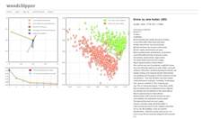

Several MITH staff members are currently working on [Project Bamboo](http://www.projectbamboo.org), a partnership of ten research universities, led by [University of California, Berkeley](http://berkeley.edu/), and including [Australian National University](http://www.anu.edu.au/); [Indiana University](http://www.indiana.edu/); [Northwestern University](http://www.northwestern.edu/); [Tufts University](http://www.tufts.edu/); [University of Chicago](http://www.uchicago.edu); [University of Illinois at Urbana-Champaign](http://illinois.edu/); [University of Maryland](http://www.umd.edu/); [University of Oxford](http://www.ox.ac.uk/); and [University of Wisconsin-Madison](http://www.wisc.edu/). Within Bamboo, MITH is leading Corpora Space. We are designing research environments where scholars may discover, analyze and curate digital texts across the 450 years of print culture in English from 1473 until 1923, along with the texts from the Classical world upon which that print culture is based. We are initially focusing on the following collections: [AUSTLit](http://www.austlit.edu.au/); [Nineteenth-century Scholarship Online](http://www.nines.org/) (NINES); [Google Books](http://books.google.com/); [HathiTrust](http://www.hathitrust.org/); [Oxford Text Archive](http://ota.ahds.ac.uk/); [Perseus Digital Library](http://www.perseus.tufts.edu); and [Text Creation Partnership](http://www.lib.umich.edu/tcp/index.html) of Early English Books Online (EEBO) and Eighteenth Century Collections Online (ECCO).

As part of the design phase, Corpora Space held a series of workshops over the past eight months. The first meeting between Bamboo and Google gave Corpora Space partners insight into Google’s design principles and process. The second workshop brought together software developers and scholars for a three-day CorporaCamp at MITH. Over the course of the three days, participants successfully built the Woodchipper, a prototype application for exploring distributed, large-scale collections through visualizations supported by techniques from data mining and natural language processing. The Woodchipper has been tested across large subsets—up to several hundred million words — of the HathiTrust Digital Library, EEBO-TCP and ECCO-TCP, and the Perseus Digital Library. It allows users to build collections of texts from across these sources and to explore these collections by mapping them in a two-dimensional thematic space. (We are currently inviting users to [alpha test](http://mith.umd.edu/corporacamp/signup.php) the Woodchipper).

MITH held ToolMixer, the third workshop in the Corpora Space Design process, on June 6-7. Tool builders, scholars, and members of Project Bamboo met to work on key issues related to connecting tools and architecture to digital collections. Project Bamboo partners were joined by representatives of the [Scholars’ Lab](http://www2.lib.virginia.edu/scholarslab/) at the University of Virginia, [NINES](http://www.nines.org/) and [18thConnect](http://www.18thconnect.org/), [HathiTrust Research Center](http://www.hathitrust.org/), SEASR, [University of Nebraska-Lincoln](http://www.unl.edu/), and [University of California Riverside](http://www.ucr.edu/) to hear presentations from tool builders and plan how tools would connect to the Corpora Space infrastructure. Additionally, we conducted break-out sessions to discuss how the various tools would link together in a scholarly workflow. This workshop brought us significantly closer to finalizing decisions about the core set of tools to be included in the initial implementation phase of Corpora Space, slated for Spring 2012.

Our live tweets from the two-day event are archived under [#toolmix](http://twapperkeeper.com/hashtag/toolmix). Additionally, please return to the blog to read more on the latest developments of MITH’s role in Project Bamboo.
