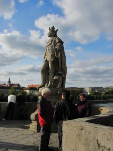
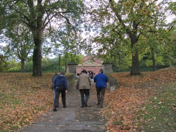
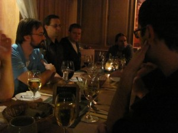

The past two days have been a flurry of coding, sometimes even going on to 1-2 in the morning. This group is highly enthusiastic about making progress in their individual groups. This energy has been pretty contagious and I've had less time for blogging. Regardless, here's some reports from the Interedition Bootcamp weekend:

Saturday night at dinner, there was a great conversation between myself and Gregor Middell about Interedition and how it differs from the normal day to day of Humanities centers. Gregor's opinion is that Interedition, as well as similar Bootcamps or 'hackathons', provide a space for DH developers to freely express ideas and experiment with their projects. Gregor's thought was that outside of bootcamps, a top-down model is used to organize outcomes of a project and limit massive scope creep and expenditures. This can feel limiting to the types of humanities researchers and hackers that come to events like Interedition and just want to try different methods to gain results. Joris van Zundert, Gregor, and the other Interedition organizers hope that their own bootcamp tradition can continue for these reasons.

This kind of attitude, I added, has implications for centers such as MITH. Originally, MITH was suggested to participate in Interedition due to our work in the [Text and Image Linking Environment](http://mith.umd.edu/tile "Text and Image Linking Environment") project, as well as other projects where we worked with annotation, such as the [Shakespeare Quartos Archive](http://www.quartos.org/). MITH has since grown and expanded in its interests, as well as the centers from which the other participants hail from. It's good that Interedition enthuses this kind of growth by offering a place to freely experiment and hack on ideas and challenges.

For OAC, we've ended up doing a lot of interesting experimentation. Asaf Bartov has created a Ruby on Rails server to act as a repository for OAC-spec-friendly annotations (Github is [here](https://github.com/abartov/raxld), and a temporary online service is [here](http://interedition.performantsoftware.com/)). Marcos Petris (CATMA) and Moritz Wissenbach (Faust Edition) are developing a service for producing constraint URIs for OAC annotations (Github is [here](https://github.com/wissenbach/fragment-context), plus they have a temporary installation online [here](http://87.106.12.254:8182/)). Cesar Ruiz and Jaoquin Gayoso Cabada from the University of Madrid have developed a wrapper application to interact with Asaf's online repository (Github is [here](https://github.com/gayoxo/Interedition)). I myself am working on a wrapper to register annotations with Asaf's server using the recently developed MITHGrid library (Github is [here](https://github.com/jdickie/MMClient)). We're having some issues with jQuery ajax calls going to his server, so it's still under development - keep watching the commits on Github.

[Wendell Piez](http://web.archive.org/web/20130404030529/http://piez.org:80/wendell/) has joined the group and is offering his help to the text editor hack group, which has made a lot of progress. They now have a text editor running with an HTML5 canvas that draws text, while also drawing underlying, color-coded annotation layers. It's a fascinating project and it's drawing a lot of attention of the group.

Tomorrow will be a round-up of everyone's progress, so I'll be looking forward to hearing from all of the groups and their exciting projects!

I'll leave you with some pictures from last night, where we had dinner at the Old Mill restaurant - a staple of the Wuerzburg scene. Locals like to get their local wine here and sit on the nearby bridge during the day. At night, they offer some of the best food in town, as well as the best of the local wine. I hate to say it, but it's going to be hard for Maryland to top this kind of attraction.

Auf Wiedersehen,

Grant