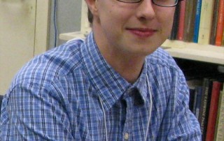

Tuesday, April 24, 12:30-1:45pm B0135 McKeldin Library, MITH Conference Room

"Enhancing the Bibliosphere: Bringing Historical Libraries to Life at LibraryThing" by **JEREMY DIBBELL**

I will discuss the Libraries of Early America project, an effort to digitize and make widely available the library collections of American readers from the early colonial period through 1825. Using the online book-cataloging site LibraryThing.com, scholars and volunteers from institutions around the country - including Monticello, the Boston Public Library, the Massachusetts Historical Society, the Boston Athenaeum, the American Antiquarian Society and others - have begun the process of creating an extensive online database of early American libraries. Current subjects include Thomas Jefferson, John Adams, Benjamin Franklin, Lady Jean Skipwith, James and Mary Murray, and other early American readers (some well-known, others obscure).

Unlike standalone institutional databases or online library catalogs, the Libraries of Early America collections through LibraryThing allow users to quickly and easily make comparisons between libraries (what books did John Adams and Benjamin Franklin have in common, for example, or what books were most commonly shared among all the Signers of the Declaration of Independence?), and to search collections which may not exist today in physical form or which are spread across multiple institutions and private collections. A reconstruction of the multi-generational Mather Family library makes those titles widely available for the first time. Further, LibraryThing's capabilities allow significant data about each book to be added to the record where known: transcriptions of marginalia, information about acquisition of the title, the binding, correspondence about a given book, or even a link to a digital scan of the volumes (as with the John Adams collection at the Boston Public Library).

So far, data on more than 1,250 early American libraries has been added, with more information constantly being collected and included. I'll discuss the origins of the project, sources and methods, and future plans and enhancements.

This talk will be held in the MITH Conference Room.

**Jeremy Dibbell** is the Librarian for Social Media and Rare Books at LibraryThing. He received his B.A. from Union College and M.A./M.L.S. degrees in History and Library Science from Simmons College. In the summers, he can generally be found at the University of Virginia's Rare Book School, assisting with the school's weeklong courses. Along with the Libraries of Early America project, Jeremy's at work on a history of books and printing in Bermuda, writes regular columns for "Fine Books & Collections" magazine, and blogs about books and reading at PhiloBiblos (philobiblos.blogspot.com). He can be found on Twitter at @JBD1.

A continuously updated schedule of talks is also available on the Digital Dialogues webpage.

Unable to attend the events in person?

Archived podcasts can be found on the MITH website, and you can follow our Digital Dialogues Twitter account @digdialog as well as the Twitter hashtag #mithdd to keep up with live tweets from our sessions.

All talks free and open to the public. Attendees are welcome to bring their own lunches.

Contact: Emma Millon, Community Lead, MITH (http://mith.umd.edu, mith@umd.edu, 5-9887).
