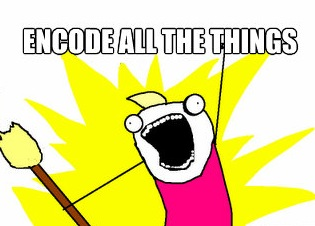

Team MARKUP, a group of graduate students working with the [Shelley-Godwin Archive](http://shelleygodwinarchive.org/), evolved as a encoding project in Professor and MITH Director Neil Fraistat's[ Technoromanticism graduate seminar](http://mith.umd.edu/eng738T) (English 738T) during the Spring 2012 term at the University of Maryland; our team was augmented by several students in[ the sister course](http://digital19thcentury.wordpress.com/) taught by Professor Andrew Stauffer at the University of Virginia. The project involved using git and GitHub to manage a collaborative encoding project, practicing TEI and the use of the Oxygen XML editor for markup and validation, and encoding and quality-control checking nearly 100 pages of Mary Shelley's Frankenstein manuscript for the[ Shelley-Godwin Archive](http://shelleygodwinarchive.org/), with each student encoding ten pages of the manuscript.

Team MARKUP collaboratively authored [a post on the several phases of the project](http://mith.umd.edu/eng738T/team-markup-encoding-frankenstein-for-the-shelley-godwin-archive-2/) over on the [Technoromanticism blog](http://mith.umd.edu/eng738T/), so here I’ll address my personal experience of the project.

## Six takeaways from the Team MARKUP project:

**1. Affective editing is effective editing?** One of my favorite quotations—so beloved that it shapes my professional work and has been reused shamelessly on my Ph.D. exams list, a Society for Textual Scholarship[ panel abstract](http://web.archive.org/web/20151223202657/http://literaturegeek.com/2012/02/17/society-for-textual-scholarship-panel-abstract/), and at least one paper—is Gary Taylor’s reasoning on the meaningfulness of editing: “How can you love a work, if you don't know it? How can you know it, if you can't get near it? How can you get near it, without editors?”\*. My interests focus on participatory editing because I want to help others get near the literature I love. Encoding my editorial decisions with TEI pushed me a step closer to the text than my previous non-encoded editorial experience, something I didn’t know was possible.

My ten pages happened to be the first pages of the Creature’s monologue; hearing the voice of the Creature by seeing the handwriting of its true creator, Mary Shelley, gave me shivers—meaningful shivers accompanied by a greater understanding of important aspects of Shelley’s writing, such as the large editorial impact made by her husband Percy and the differing ways she crossed out or emphasized changes to her draft. Moving between the manuscripts images and the TEI encoding—so similar to my other work as a web designer and developer—also emphasized the differences in the writing process of my generation and the work that went into inscribing, organizing, and editing a book without the aid of a mechanical or digital device.

**2. Project management.** Because we didn’t know what to expect from the project until we were in the thick of encoding—would everyone be able to correctly encode ten full pages? how would we control quality across our work? what would our finished pages look like in terms of encoding depth?—we spent most of the project functioning as a large team, which was both sometimes as unwieldy as our large GoogleDoc (trying to find a time when eight busy graduate students can meet outside of class time is difficult!) and sometimes made sense (I was one of the few people on our team comfortable with GitHub and encoding at the start of the project, so I helped with a lot of one-on-one Skype, in-person, and email sessions early on). If I did the project over, I would have held a single Bootcamp day where we all installed and pushed within GitHub and encoded one page of manuscript up on the projector screen, then delegated my role as team organizer by dividing us into three subgroups. I also might have insisted on people agreeing ahead of time on being available for specific in-person meeting times, rather than trying to schedule these one or two weeks beforehand. I do think things worked out pretty well as they did, largely because we had such a great team. Having the GoogleDoc (discussed more below) as a central point for tech how-tos, advice, and questions was also a good choice, though in a larger project I’d probably explore a multi-page option such as a wiki so that information was a) easier to navigate and b) easily made public at the end of our project.

**3. Changing schemas and encoding as interpretive.** Encoders who started their work early realized that their efforts had good and bad results: because the schema saw frequent updates during our work, those who finished fast needed to repeatedly update their encoding (e.g. a major change was removing the use of &lt;mod type>s). Of course it was frustrating to need to update work we thought was finished—but this was also a great lesson about work with a real digital edition. Not only did the schema changes get across that the schema was a dynamic response to the evolving methodology of the archive, it prepared us for work as encoders outside of a classroom assignment. Finally, seeing the schema as a dynamic entity up for discussion emphasized that even among more seasoned encoders, there are many ways to encode the same issue: encoding, as with all editing, is ultimately interpretative.

**4. Encode all the things! Or not.** Depth of encoding was a difficult issue to understand early on; once we’d encoded a few pages, I began to have a better sense of what required encoding and what aspects of the manuscript images I could ignore. Initially, I was driven to encode everything, to model what I saw as thoroughly as possible: sums in the margins, different types of overstrikes, and analytical bibliography aspects such as smudges and burns and creases.

What helped me begin to judge what to encode was understanding what was useful for Team MARKUP to encode (the basics that would apply to future encoding work: page structure and additions and deletions), what was useful for more advanced encoders to tackle (sitting in on the SGA staff meetings, I knew that some of our work would be subject to find-and-replace by people more experienced with Percy and Mary’s handwriting styles), and what our final audience would do with our XML (e.g. smudges and burns weren’t important, but Percy’s doodles could indicate an editorial state of mind useful to the literary scholar).

**5. Editorial pedagogy.** Working on Team MARKUP not only improved my markup skills, it also gave me more experience with teaching various skills related to editions. As I mentioned above, acting as organizer and de facto tech person for the team gave me a chance to write up some documentation on using GitHub and Oxygen for encoding work. I’m developing this content for[ this set of GitHub Pages](http://amandavisconti.github.com/markup-pedagogy/) to help other new encoders work with the Shelley-Godwin Archive and other encoding projects. Happily, I was already scheduled to talk about editorial pedagogy at two conferences right after this seminar ends; the Team MARKUP experience will definitely become part of my talks during[ a panel](http://web.archive.org/web/20151223202657/http://literaturegeek.com/2012/02/17/society-for-textual-scholarship-panel-abstract/) I organized on embedding editorial pedagogy in editions (Society for Textual Scholarship conference,) and[ a talk](http://www.dhsi.org/events.php) on my Choose-Your-Own-Edition editorial pedagogy + games prototype at the Digital Humanities Summer Institute colloquium in Victoria.

**6. Ideas for future encoding work.** I’ve started to think about ways to encode Frankenstein more deeply; this thinking has taken the form of considering tags that would let me ask questions about the thematics of the manuscript using Python or[ TextVoyeur](http://web.archive.org/web/20150312052932/http://hermeneuti.ca:80/voyeur) (aka Voyant); I’m also interested in markup that deals with the analytical bibliography aspects of the text, but need to spend more time with the rest of the manuscript images before I think about those. So far, I’ve come up with five new thematic tagging areas I might explore:

- Attitudes toward monstrosity: A tag that would identify the constellation of related words (monster, monstrous, monstrosity), any mentions of mythical supernatural creatures, metaphorical references to monstrosity (e.g. “his vampiric behavior sucks the energy out of you”), and reactions/attitudes toward the monstrous (with attributes differentiating responses to confronting monstrosity with positive, negative, and neutral attitudes). I could then track these variables as they appear across the novel and look for patterns (e.g. do we see less metaphorical references to monstrosity once a “real” monster is more prevalent in the plot?).

* Thinking about doodles: We’re currently marking marginalia doodles with &lt;figure> and a &lt;desc> tag describing the drawing. In our section of the manuscript, many (all?) of these doodles are Percy Shelley’s; I’d like to expand this tag to let me identify and sort these doodles by variables such as complexity (how much thought went into them rather than editing the adjacent text?), sense (do they illustrate the adjacent text?), and commentary (as an extension of sense tagging, does a doodle seem ironically comic given the seriousness or tragedy of the adjacent text?). For someone new to studying Percy’s editorial role, such tagging would help me understand both his editing process and his attitude toward Mary’s writing (reverent? patronizing? distracted? meditative?)

- Names, dates, places: These tags would let us create an animated timeline of the novel that shows major characters as they move across a map.

* Anatomy, whole and in part: To quote from an idea raised in[ an earlier post](http://www.literaturegeek.com/useful-prosthetics-pretty-metaphors-and-more-on-dh-tools/#more-510) of mine, I’d add tags that allowed “tracking the incidence of references to different body parts–face, arms, eyes–throughout Frankenstein, and trying to make sense of how these different terms were distributed throughout the novel. In a book concerned with the manufacture of bodies, would a distant reading show us that the placement of references to parts of the body reflected any deeper meanings, e.g. might we see more references to certain areas of the body grouped in areas of the novel with corresponding emphases on the display, observation, and action? A correlation in the frequency and placement of anatomical terms with Frankenstein‘s narrative structure felt unlikely (so unlikely that I haven’t run my test yet, and I’m not saving the idea for a paper!), but if had been lurking in Shelley’s writing choices, TextVoyeur would have made such a technique more visible.”

- Narrative frames: Tags that identified both the specifics of a current frame (who is the speaker, who is their audience, where are they, how removed in time are they from the events they narrate?) and that frame’s relationship to other frames in the novel (should we be thinking of these words as both narrated by Walton and edited by Victor?) would help create a visualization of the novel’s structure.

I expect that playing around with such tags and a distant reading tool would yield even better thinking about encoding methodology than the structural encoding I’ve been working on so far, as the decisions on when to use these tags would be so much more subjective.

\* From "The Renaissance and the End of Editing", in _Palimpsest: Textual Theory and the Humanities_, ed. George Bornstein and Ralph G. Williams (1993), 121-50.

_Amanda Visconti is Webmaster at MITH and a Ph.D. student in the University of Maryland Department of English, where she focuses on textual studies, digital humanities practice, and Modernist novels. This post was a[ DH Now](http://digitalhumanitiesnow.org/) Editor's Choice post on April 24th, 2012 and is cross-posted from [LiteratureGeek.com](http://www.literaturegeek.com)._
