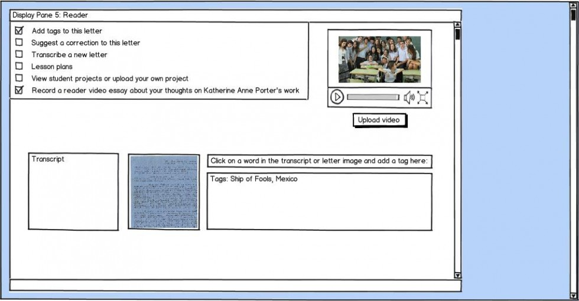

According to Christina Wodtke and Austin Govella in _Information Architecture: Blueprints for the Web_, wireframes are the spaces in which thinking becomes tangible. As my semester-long exploration of digital scholarly editions comes to a close, I have been thinking about how to synthesize the insights I’ve gleaned from the different phases of the project—from the literature review to the TEI encoding guidelines—into a set of visual representations, or wireframes, for a digital edition of Katherine Anne Porter’s letters. In other words, I have been attempting to transform my thinking into something tangible.

But I’ve also been reflecting on the connections—and the gaps—between thought, (research, intellectual endeavor) and the tangible (the physical, the authentic object). Archivists have long been preoccupied with the authenticity of the original object, the power of evidence, of historical aura. And in so many ways, archivists have been attempting to connect their tangible collections with the thinking that preoccupies researchers and scholars. Archives, then, are also spaces in which thought becomes tangible (Porter’s letters are the tangible incarnation of her thought) and the tangible becomes thought (scholars interface with her letters and transform the physical paper into their own intellectual discoveries).

Archive as wireframe? The reading room offers an architecture in which intellectual innovation can take place. Behind the scenes, the stacks are skeletal, their shelves like the ribcage that houses and defends the heart. What happens, though, when archival collections move online? What role does authenticity play in the digital realm, and how can curators use technology to preserve and even enhance the magic of the original? If a digital edition facilitates access to otherwise untouchable material, in some way, it actually enhances tangibility. In thinking about the lives of archives in digital editions and in approaching these wireframes, I have also been thinking about stewardship, about the intermingled identities of the figures who interact with and shepherd a collection—the scholar, the editor, the digital humanist, the curator.

The wireframes I have created (please pardon the rough work of a first-time wireframer) attempt to invite interaction with the letters from the perspectives of each of the letters’ stewards: the author (Porter herself), the scholar (the advanced Porter researcher), the curator (the librarians and archivists who manage the collection), and the reader (significant elements of Porter’s audience, including secondary school educators and students and non-scholarly admirers of her work). The center of the digital edition is the Letter Viewer:

The Letter Viewer’s multiple display pane model enables the visitor to view many interpretations of a letter simultaneously by clicking on a word (“Image,” “Transcript,” “Author,” “Scholar,” “Curator,” “Reader”) in the horizontal navigation bar under the letter title and dragging it to a display pane. I envision the Letter Viewer existing in an expansive HTML5-enabled plane like those of the[ Mapping the Republic of Letters](https://republicofletters.stanford.edu/) project or the web-based[ Prezi](http://prezi.com/your/) software. Side-by-side comparisons of image and transcription are just the beginning of the opportunities afforded by this interface.

The Author view presents an interactive timeline display that illuminates information about a letter in the context of Porter’s biography and bibliography:

The Scholar view provides visitors with access to annotations, related research, and the downloadable “data” underlying the project:

The Curator view illuminates the provenance of the Porter letters. Porter served as curator of her own letters in her lifetime and invested great thought into her legacy. Revealing the lives of the letters in the stacks of the Library provides insight into the physicality of the collection and the authenticity of historical objects:

The Reader view offers opportunities for interactivity and invites the participation of several crucial elements of Porter’s audience:

As a whole, these wireframes offer a test case for how a digital project can represent the life and stewardship of an archival collection in a university setting. In other words, this digital edition, itself, is a reflection on the practice of assembling, structuring, and preserving digital editions. Someday soon the project will transform from skeleton to tangible digital physique, and in the capable hands of the Maryland team, I know it will be as radiant and as bright as Porter herself. I am excited (and no doubt Porter would be, too) to imagine these rich letters taking on a new digital life.

_Wendy Hagenmaier is a 2012 Master's Candidate at the School of Information at the University of Texas at Austin. She is blogging about her Capstone Professional Experience Project involving a digital edition of letters from the Katherine Anne Porter Papers (<http://hdl.handle.net/1903.1/1532>) at the University of Maryland. Jennie Levine Knies, Manager, Digital Stewardship, Beth Alvarez, Curator of Literary Manuscripts Emerita, and Trevor Muñoz, Associate Director of MITH and Assistant Dean for Digital Humanities Research, University of Maryland Libraries, are supervising the project, alongside MITH-alum Tanya Clement, Assistant Professor, UT iSchool._
