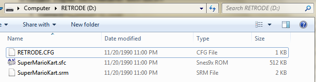
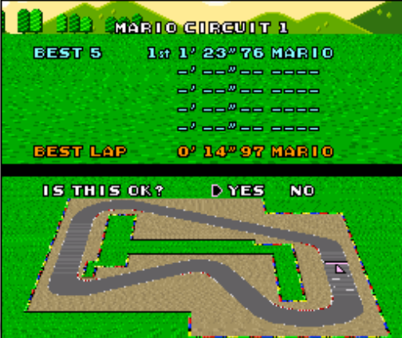

I had originally planned to use this post to log my adventures in desoldering the CPU from the Nintendo Entertainment System (NES), but, alas, the campus couriers are holding the all-important [solder sucker](http://en.wikipedia.org/wiki/Desoldering#Desoldering_pump) hostage. Instead, I'll talk a little bit about the work we've done with the Super Nintendo Entertainment System (SNES), which involves significantly less molten metal.

One goal of the [Preserving Virtual Worlds 2](http://mith.umd.edu/research/pvwii/) (PVW2) project is to provide videogame curators with information and tools to make their job easier. One small but important step in any digital preservation workflow is auditing the files--making sure that the bitstream you have in your repository is the same as the bitstream on the original media (or, down the line, making sure that the bitstream in the repository is the same as the bitstream you originally ingested). This is sometimes referred to as an integrity check, and with files stored and accessed on ordinary media is a relatively trivial matter of calculating a [checksum](http://www.iasa-web.org/tc04/integrity-and-checksums) at ingest and checking that the same number is still derived when the same algorithm is applied to the bitstream at regular intervals. When data is being migrated into a new format, it is also wise to make sure nothing is lost when accessing the file in the new format, which is why you'll find color strips in the toolkit of digitization QCers.

When we migrate SNES games to a media neutral format, we're taking code that was originally burned into a read-only chip (ROM) and creating a digital file. We then access that digital file using a software emulator instead of proprietary hardware designed to do nothing but read those cartridges. This raises two questions:

- - 1. How do we know that the file we save matches the file originally burned on the ROM?
    2. How do we know that the emulator is correctly interpreting the ROM?

To answer these questions, we're using a nifty device called the [Retrode2](http://www.retrode.org/about/). The Retrode allows you to play SNES cartridges with original SNES controllers through an emulator on your computer. As a side effect, it also allows you to extract ROM files and savegames (SRAM) and to write new files to the SRAM. The following workflow is based on the assumption that

- - 1. A ROM file which will read an original savegame from an SNES cartridge is likely an accurate representation of the game.
    2. An emulator which produces a savegame which can be loaded by the game on the original cartridge likely presents an accurate representation of gameplay.

### Setting up the Retrode2

The Retrode box contains the Retrode unit, a Mini-USB cable, and a simple sheet of instructions. SNES cartridges are inserted in the rear slot, facing backwards. Controllers are plugged into the side ports.

Before using the Retrode, it is necessary to flash the firmware (the firmware it ships with is known to have some errors with SNES controllers). The latest firmware, along with some basic instruction, are available [here](http://www.retrode.org/documentation/firmware/). If you’re using Windows and have difficulty with FLIP, try running it as Administrator.

Once you’ve successfully updated the firmware and reset the device, open up the Retrode in a file manager. Note the datestamp--files on the Retrode will a**lways** display this datestamp, even if you have updated them (when the device has been reset after any file changes).

Open the file [RETRODE.CFG](http://www.retrode.org/documentation/the-retrode-cfg-file/) in a text editor. Your filenames may include a number after the game title. If you’d like to disable this, change the value on **line 15** for from **1** to **0**. In order to write savegames to the cartridge, it is also necessary to change the value for \[sramReadonly] on **line 17** from **1** to **0**. _Only_ change this value if and when you are writing a savegame to the cartridge. Leaving it on provides some small security against accidentally corrupting your save file. Save. If for some reason saving the config file fails, refer to procedures for writing an SRAM (save) file to the cartidge.

1. ; Retrode .17g - Config
2. ; Remove any line to revert setting to factory default
3. \[HIDMode] 1 ; 0: Off; 1: 4Joy+Mouse; 2: 2Joy; 3: KB; 4: iCade
4. ; Hex codes for KB mode (in this order):
5. ; SNES gamepad: B Y SEL STA ^ v &lt; > A X L R
6. ; In NES mode: A B SEL STA ^ v &lt; > x x x x
7. ; SEGA gamepad: B A MOD STA ^ v &lt; > C Y X Z
8. ; See usb.org/developers/devclass_docs/Hut1_11.pdf (pp.53ff)
9. \[kbL] 06 1b 28 2c 52 51 50 4f 09 07 04 16
10. \[kbR] 10 11 05 19 33 37 36 38 0e 0d 0a 0b
11. \[nesMode] 0 ; 1: NES gamepads; 0: SNES
12. \[filenameChksum] 0 ; checksum in filename? 0,1
13. \[detectionDelay] 5 ; how long to wait after cart insertion/removal
14. \[sramReadonly] 0 ; write protect SRAM?
15. \[segaSram16bit] 0 ; use 16bit words for SRAM?
16. \[sramExt] srm
17. \[snesRomExt] sfc
18. \[segaRomExt] bin
19. ; Override autodetect:
20. \[forceSystem] auto
21. \[forceSize] 0
22. \[forceMapper] 0
23. ; Optional plug-ins:
24. \[atariRomExt] a26
25. \[tg16RomExt] huc
26. \[vbRomExt] vbr
27. \[n64RomExt] n64
28. \[gbRomExt] gb
29. \[gbaRomExt] gba

Here it is, set up and running Super Mario Kart:

### Setting up an Emulator

SNES9x is an emulator available for all major platforms. To run it, simply extract the contents of the zipfile to a directory of your choice.

The SNES game pad must be setup as the input device within the emulator. To do this, select **Input->Input Configuration** in the top menu or press **Alt+F7**. Click your mouse in the “Up” textbox, and then press the corresponding buttons on the SNES controller until all buttons have (J0) or (J1) values. Ignore the buttons after the R-button.

**Select File->Load Game** or type **Ctrl+O** and navigate to the Retrode directory. Open the **\*.sfc** file; opening the **\*.srm** (save) file will just cause the emulator to hang. When you play the game, it should reflect any data currently stored in the cartridge’s SRAM. The \*.sfc file can be copied to SNES9x’s **Roms** directory for later play without the Retrode.

### Extracting and Injecting Battery Saves

To extract a save file, simply copy the \*.srm file to a local directory (for instance, SNES9x’s Saves directory).

Ensure that \[sramReadonly] on **line 17** is set to **0** in RETRODE.CFG. If you get “Access denied.” or a similar error message when attempting to inject a save, this value is set to 1.

Some command-line work is necessary to inject a new savefile onto the SRAM. In Windows, type “**cmd**” in the Start Menu, right click the program that shows up, and select “Run as Administrator.” On other platforms, use the Terminal. Note the location of the NEW save file as well as the drive letter/location of the Retrode. The new save file must have the same name as the file you are replacing. Case is important. In this example we will be placing a new save file onto a Super Mario Kart cartridge. At the command line (in Windows), type:

type C:PathtoNewSaveGame.srm > D:SaveGame.srm

so, for Super Mario Kart

type Z:DocumentsMITHPVWSNESsnes9xSavesSuperMarioKart.srm > D:SuperMarioKart.srm

on Mac/Linux you can either use

cat /path/to/New/SaveGame.srm > /path/to/SaveGame.srm

or

dd if=/path/to/New/SaveGame.srm of=/path/to/SaveGame.srm

When you look at the Retrode in a file manager, the srm file should now reflect today’s date. After the Retrode has been reset, _even if you were successful_, the datestamp will revert to the standard 1990 date. To see if the transfer was successful, clear out any files in SNES9x’s Save directory (it has a tendency to privilege local save files) and open the \*.sfc file from the Retrode. The game data should now reflect the new savegame rather than whatever was originally on the cartridge. The easiest way to check this in Super Mario Kart is to look at Time Trials.

If for some reason you get a CHKSUM error and SNES9x hangs, fear not! Playing the game with an original SNES console should fix the problem. This is most likely to happen if you use the OS’s GUI copy command rather than writing over the file at the command line.

The drawback to this workflow is that it only works with SNES cartridges that support saving. It also depends on the battery which powers those saves being live, though it is easy to replace that battery with a little technical know-how. It does, however, give us a way to audit a fair subset of SNES games and it's a lot of fun!