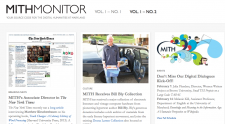

A new semester has begun here at the Maryland Institute of Technology for the Humanities (MITH). With it brings news of collaborative projects, successful workshops we’ve attended and hosted, and the fun always had in the daily life of MITH. The _MITH Monitor_ is available in hard copy and [digital ](http://mith.umd.edu/monitor/spring-2012)formats. We invite you to take a look!

If you’d like to be added to our print mailing list, please contact Emma Millon, Community Lead, _emillon\[fusion_builder_container hundred_percent="yes" overflow="visible"]\[fusion_builder_row]\[fusion_builder_column type="1_1" background_position="left top" background_color="" border_size="" border_color="" border_style="solid" spacing="yes" background_image="" background_repeat="no-repeat" padding="" margin_top="0px" margin_bottom="0px" class="" id="" animation_type="" animation_speed="0.3" animation_direction="left" hide_on_mobile="no" center_content="no" min_height="none"]\[at]umd\[dot]edu._