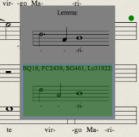

Google Summer of Code (GSoC) is over, and it’s time to recap what has been done during a greatly productive summer. Not only has my project has achieved its main objectives, but as a result I was able to demonstrate the results at the [École Thématique](http://duchemin.haverford.edu/editorsforum/ecole-thematique-2013/), Centre d’Étude Supérieures de la Renaissance in Tours, France in late October.

For readers not familiar with the project, [_MEI to VexFlow_](https://github.com/TEI-Music-SIG/MEItoVexFlow) is a web-based software component that allows web browsers to display music notation stored in the so-called [MEI (Musi](http://music-encoding.org/)[c Encoding Initiative](http://music-encoding.org/)) format. For more information about the project, see my [initial](http://mith.umd.edu/mei-to-vexflow/) and [mid-term](http://mith.umd.edu/mei-to-vexflow/) posts.

Historical musical pieces make their way to us through multiple documents and it often happens that multiple sources introduce differences and variants in the music. As the final task of the GSoC project, I designed a sample web application called [meiView](http://zolaemil.github.io/meiView) that is be able to display 15–16th century music (more precisely, the transcription of such music into common western music notation), and provide a dynamic mechanism for the user to select which variant they want to see.

To see it working, open [meiView](http://zolaemil.github.io/meiView), and click on the green dots to see the differences between the sources. In the sidebar you can see the highlighted sources and variants you have selected. When you select a variant, the score automatically updates so that the selected variant is displayed.

**Overview**

MEI is an XML format that is able to represent differences between various sources, so I wanted to create an application that presented the textual ambiguities visually. When visualizing the ambiguities, depending on the purpose of the application, there are a number of ways to approach the problem. For example if a user is making a comprehensive textual study of the score, it may be desirable that they can look at all the variants simultaneously (just like in the [Chopin Variorum Edition](http://www.ocve.org.uk/jsp/browse.jsp), where it is possible to look at a measure and see the scanned images of all the different editions at the same time). When focusing on performing practice, the preference is to keep the score as integrated and uncluttered as possible. I am very much interested in studying the latter approach, and therefore decided that the score should always display the music as it was from a single source. However thanks to its dynamic nature, the user can “customize” the score by selecting, for instance, source A at measure three and source B at measure five.

The MEI format allows editors to compile all musical information, including the differences between the sources, into a single XML file. Music editors, after thorough scholarly research, often chose to establish a “base text”, that is, a text that, according to their best judgment, is the most authentic or the most acceptable. The base text is also stored in the MEI file.

To start with, meiView renders the base text using MEI-to-VexFlow. Then it displays little green dots where different variants are available (Figure 1).

You can replace fragments of the musical text, by clicking on the green dots and selecting another variant.

In some cases, one source is different from all others, while all other sources agree. In other cases, some sources agree on one variant, and other sources agree on another. In the little pop-up variant selector window, you can see which source(s) a variant comes from (Figure 3-4).

**Evaluation**

With this application you can select an arbitrary combination of variants, effectively creating your own ‘edition’ or a customized ‘view’ of the piece. It is an extremely powerful feature compared to printed music.

Unfortunately, allowing an arbitrary combination of sources brings us to new challenges. When a semantically closely related set of differences is encoded by a number of differences in the MEI (e.g. a two-syllable word difference in lyrics is represented by two differences in MEI) it makes no sense to choose an arbitrary combination of sources. For this reason meiView currently doesn’t show differences in lyrics and it only displays local variants. That is, differences that don’t span across barlines, or if they do, they are split into multiple differences. You can check out an example of this at [page 3](http://zolaemil.github.io/meiView/index.html#score&pg=3) measure 3-4. Note that the ties don’t generally cause problems, because in more simple cases they can be encoded as a single element, therefore the difference only concerns the measure containing that element, see for instance [page 1](http://zolaemil.github.io/meiView/index.html#score&pg=1) measure 3. Fortunately, there are plans to overcome this problem by allowing the music editors to specify which combination of variants are possible and limit user options accordingly.

This project has demonstrated some of the potential of the MEI format to musicians and music scholars. According to the feedback from the participants at the [École Thématique](http://duchemin.haverford.edu/editorsforum/ecole-thematique-2013/) in Tours, there’s great interest in taking MEI-to-VexFlow and meiView even further. The application will be integrated into the [Digital Du Chemin](http://duchemin.haverford.edu/) platform.

**Acknowledgements**

I feel lucky for having been able to participate in this project, which was made possible by the Google Summer of Code program and Maryland Institute for Technology in the Humanities at theUniversity of Maryland. Also, I would like to thank my project mentor Raffaele Viglianti who provided fantastic support, and David Lee from University of Glasgow (UK) for providing me with the musical material.
