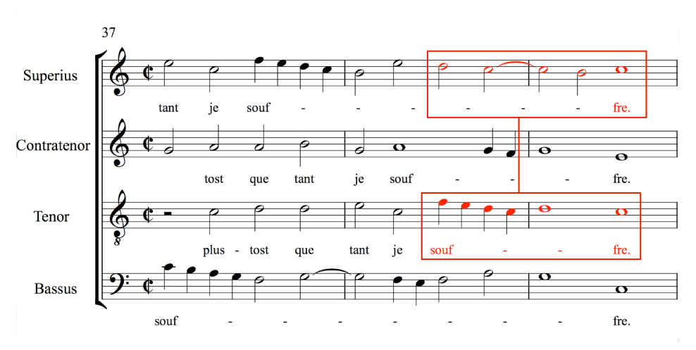

The [Enhancing Music Notation Addressability](http://mith.umd.edu/research/enhancing-music-notation-addressability/ "Enhancing Music Notation Addressability") project (EMA) is creating a system to address specific parts of a music document available online. By addressing we mean being able to talk about a specific music passage (cfr. Michael Witmore’s [blog post](http://winedarksea.org/?p=926) on textual addressability).

On paper, something equivalent could be done by circling or highlighting a part of a score. But how could this be done on a music document on the web? Would it be possible to link to a part of a score like I can link to a paragraph of a wikipedia page? How precise can I be?

Enhancing this kind of addressability could be useful to quote passages, express analytical statements and annotations, or pass a selection of music notation on to another process for rendering, computational analysis, etc.

### Project Progress as of November 2014

Most of our efforts have been focused on creating a URI syntax to address common western music notation regardless of the format of a music notation document. Music notation is represented in a variety of digital formats and there isn’t an equivalent of a “plain text” music document. Even the simplest music note is represented differently across systems. Nonetheless, there are certain primitives that are common to most music notation representation systems. These are the ones that we are considering now:

_beat_: music notation relies on beat to structure events, such as notes and rests, in time.

_measures_: typically indicated by bar lines, measures indicate a segment corresponding to a number of beats.

_staves:_ staves in scores separate music notation played by different instruments or group of instruments.

Consider the following example (from [_The Lost Voices_](http://digitalduchemin.org/piece/DC0519/) project), where we want to address the notation highlighted in red:

We can say that it occurs between measure 38 and 39, on the first and third staves (labelled _Superius_ and _Tenor_ — this is a renaissance choral piece). Measure 38, however, is not considered in full, but only starting from the third beat (there are four beats per measure in this example).

According to our syntax, this selection could be expressed as follows:

`document/measures/staves/beats/` `dc0519.mei/38-39/1,3/3-3`

The selection of measures is expressed as a range (38-39), staves can be selected through a range or separately with a comma (1,3), and beats are always relative to their measure, so 3-3 means from the third beat of the starting measure to the third beat of the ending measure. Things can get more complicated, but for that we defer to the [Music Addressability API ](https://github.com/umd-mith/ema/blob/master/docs/api.md)documentation that we've been writing (beware: it’s still a work in progress, feel free to contribute on GitHub!)

One important aspect worth noting is that the beat is the primary driver of the selection: only selections that are contiguous in beat can be expressed with this system. For now, this seems to be a sufficiently flexible way of addressing music notation and we’re working on a way to group several selections together in case the addressing act needs to be more complex — more on this next time.

### Upcoming goals for the project

Defining a Music Addressability API is fun, but it’s useless without an implementation. So we’re working on a web service able to parse the URL syntax described in the API and to retrieve the addressed music notation from a file encoded according the Music Encoding Initiative format (MEI). Unlike the URL syntax, the implementation has to be format specific, because it needs to know how measures, staves, and beats are represented to be able to parse and retrieve them.

We’re using MEI because our next step in the new year will be focusing on our case-study data: a corpus of renaissance songs edited and published by the [_Lost Voices_](http://digitalduchemin.org "Lost Voices project") project. Students involved on the project have created a number of micro-analyses of different parts of the scores; we’ll re-model them using the URL syntax specified by the Music Addressability API to test its effectiveness.

### Challenges still ahead

After collecting feedback from the MEI community, we were able to identify some aspects of the API that still need to be ironed out. Relying on beat works well because music typically has beat. Music notation, however, often breaks rules in favor of flexibility. Cadenzas, for example, are ornamental passages of an improvisational nature that can be written out with notation that disregards a measure’s beat. How could we address only part of a cadenza if beat is not available? This is one of a few ideas that are drawing us back to the whiteboard and we look forward to developing solutions.

If you’re interested in what EMA is setting out to do, please do get in touch and make sure to keep an eye on our GitHub repository where we’ll keep updating the API and release tools.

_EMA is a one-year project funded by the NEH DH Start-Up Grants program._