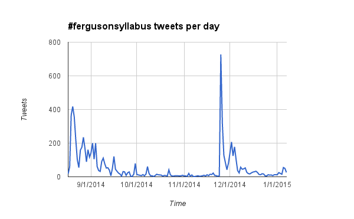

As a new semester is about to begin academics are busily putting finishing touches on their course syllabi. Here at the University of Maryland there has been sustained interest over the past few months in integrating discussion and thinking about the recent events in Ferguson, and subsequent #BlackLivesMatter movement into our classes. Look for news about planned teach-ins and events like [ours](http://mith.umd.edu/researching-ferguson-update-previewing-miths-teach-ins-blacklivesmatter-umd/) in the coming weeks.

If you are interested in finding Ferguson and #BlackLivesMatter resources to use in your coursework one place to look is the [#FergusonSyllabus](https://twitter.com/search?q=%23fergusonsyllabus) hashtag on Twitter. [Marcia Chatelain](https://twitter.com/drmchatelain), a history professor at Georgetown University and a University of Missouri–Columbia alumna, started this hashtag with this tweet back in August of 2014:

https://twitter.com/DrMChatelain/status/501042404196376576

You can [listen](http://news.stlpublicradio.org/post/educators-use-twitter-teach-about-ferguson-build-syllabuses) to an interview with Chatelain from Saint-Louis Public Radio soon conducted just a few days after this tweet. Since then there have been over 8,000 tweets with the #FergusonSyllabus hashtag. Chatelain wrote a post about her favorite [suggested resources](http://www.dissentmagazine.org/blog/teaching-ferguson-syllabus), and you can find other lists, such as this [Google Doc](https://docs.google.com/document/d/1kwZl23Q9tgZ23dxSJWS-WpjZhOZ_mzVPtWL8-pWuLt8/edit?usp=sharing) from [Daniel Krutka](https://twitter.com/dankrutka), a Professor of Education at Texas Woman's University.

Here at MITH we have a collection of these tweets between August 17th 2014 and January 7th, 2015. We have done some rudimentary analysis that we thought we would share here. If you have ideas for things to do with this collection please let us know.

## Timeline of Activity

## Top 25 Most Mentioned Web Resources

| Web Page                                                                                                                                                                                                                                                    | Mentions                                                                                                              |
| ----------------------------------------------------------------------------------------------------------------------------------------------------------------------------------------------------------------------------------------------------------- | --------------------------------------------------------------------------------------------------------------------- |
| [Rhetoric Race and Religion: #FergusonFiasco: The Killing of #MichaelBrown: A Reader](http://rhetoricraceandreligion.blogspot.com/p/the-murder-of-michaelbrown-reader.html?spref=tw)                                                                        | 271                                                                                                                   |
| [Rhetoric Race and Religion: #FergusonSyllabus: The #FergusonFiasco and Teaching African American Theology](http://rhetoricraceandreligion.blogspot.com/2014/08/fergusonsyllabus-fergusonfiasco-and.html?spref=tw)                                          | 226                                                                                                                   |
| [Rhetoric Race and Religion: #FergusonFiasco: Doing Theology After #Ferguson-Part 1](http://rhetoricraceandreligion.blogspot.com/2014/09/fergusonfiasco-doing-theology-after.html?spref=tw)                                                                 | 127                                                                                                                   |
| [Prison Culture » #FergusonSyllabus: Talking and Teaching About Police Violence](http://www.usprisonculture.com/blog/2014/08/31/fergusonsyllabus-talking-and-teaching-about-police-violence/)                                                               | 112                                                                                                                   |
| [Ferguson and college education: Sociology and history professors teach the #fergusonsyllabus.](http://www.slate.com/articles/life/education/2014/09/ferguson_and_college_education_sociology_and_history_professors_teach_the.html)                        | 59                                                                                                                    |
| [TTT Studio and Chat                                                                                                                                                                                                                                        | EdTechTalk](http://edtechtalk.com/ttt)                                                                                | 55 |
| [Teaching #FergusonResources - Google Docs](https://docs.google.com/document/d/1kwZl23Q9tgZ23dxSJWS-WpjZhOZ_mzVPtWL8-pWuLt8/edit?pli=1)                                                                                                                     | 50                                                                                                                    |
| [How to Teach Kids About What's Happening in Ferguson - The Atlantic](http://www.theatlantic.com/education/archive/2014/08/how-to-teach-kids-about-whats-happening-in-ferguson/379049/)                                                                     | 47                                                                                                                    |
| [#FergusonSyllabus (with images, tweets) · neelofer · Storify](https://storify.com/neelofer/fergusonsyllabus)                                                                                                                                               | 46                                                                                                                    |
| [Rhetoric Race and Religion: #FergusonFiasco: The Killing of #MichaelBrown: A Reader](http://rhetoricraceandreligion.blogspot.com/p/the-murder-of-michaelbrown-reader.html#.U_tAgq8Qaas.twitter)                                                            | 39                                                                                                                    |
| [Teaching the #FergusonSyllabus                                                                                                                                                                                                                             | Dissent Magazine](http://www.dissentmagazine.org/blog/teaching-ferguson-syllabus)                                     | 37 |
| [Ferguson Syllabus « Sociologists for Justice](http://sociologistsforjustice.org/ferguson-syllabus/)                                                                                                                                                        | 30                                                                                                                    |
| [How the #FergusonSyllabus Can Help Teachers Talk About Race and Rights in School                                                                                                                                                                           | Alternet](http://www.alternet.org/education/how-fergusonsyllabus-can-help-teachers-talk-about-race-and-rights-school) | 28 |
| [The Ferguson Syllabus](http://sociology.about.com/od/Current-Events-in-Sociological-Context/fl/The-Ferguson-Syllabus.htm)                                                                                                                                  | 27                                                                                                                    |
| [Rhetoric Race and Religion: Why Holder Did Not Have to Come, or Why We March and Protest](http://rhetoricraceandreligion.blogspot.com/2014/09/why-holder-did-not-have-to-come-or-why.html?spref=tw)                                                        | 25                                                                                                                    |
| [Teaching About Ferguson: Do’s and Don’ts - The Root](http://www.theroot.com/articles/culture/2014/09/teaching_about_ferguson_do_s_and_don_ts.html)                                                                                                         | 25                                                                                                                    |
|                                                                                                                                                                                                                                                             | 24                                                                                                                    |
| [Teaching About Ferguson                                                                                                                                                                                                                                    | Teaching for Change](http://www.teachingforchange.org/teaching-about-ferguson)                                        | 22 |
| [Race--Not Just a Hot Topic - Race Matters in the Classroom](http://wabashcenter.typepad.com/antiracism_pedagogy/2014/10/race-not-just-a-hot-topic.html)                                                                                                    | 21                                                                                                                    |
| [Ferguson and college education: Sociology and history professors teach the #fergusonsyllabus.](http://www.slate.com/articles/life/education/2014/09/ferguson_and_college_education_sociology_and_history_professors_teach_the.html?wpsrc=sh_all_dt_tw_top) | 20                                                                                                                    |
| [Whiteness And Anxiety In The Diverse Classroom - Race Matters in the Classroom](http://wabashcenter.typepad.com/antiracism_pedagogy/2014/10/whiteness-and-anxiety-in-the-diverse-classroom.html)                                                           | 20                                                                                                                    |
| [How the #FergusonSyllabus Can Help Teachers Talk About Race and Rights on the First Day of School by Liz Pleasant — YES! Magazine](http://www.yesmagazine.org/peace-justice/how-the-ferguson-syllabus-can-help-teachers-talk-race-and-rights)              | 19                                                                                                                    |
| [How the #FergusonSyllabus Can Help Teachers Talk About Race and Rights on the First Day of School](http://truth-out.org/opinion/item/25889-how-the-fergusonsyllabus-can-help-teachers-talk-about-race-and-rights-on-the-first-day-of-school)               | 19                                                                                                                    |
| [How to Teach Kids About What's Happening in Ferguson - Atlantic Mobile](http://m.theatlantic.com/education/archive/2014/08/how-to-teach-kids-about-whats-happening-in-ferguson/379049/)                                                                    | 18                                                                                                                    |
| [bending arc toward justice](http://www.laprogressive.com/bending-arc-toward-justice/)                                                                                                                                                                      | 18                                                                                                                    |
| [How to talk to students about Ferguson                                                                                                                                                                                                                     | PBS NewsHour](http://www.pbs.org/newshour/updates/talk-students-ferguson/)                                            | 16 |

## Top 5 Most Active #FergusonSyllabus Users

|                                                           |     |
| --------------------------------------------------------- | --- |
| [R3](http://twitter.com/examinereligion)                  | 365 |
| [Dr. Marcia Chatelain](http://twitter.com/DrMChatelain)   | 332 |
| [Andre E. Johnson](http://twitter.com/aejohnsonphd)       | 211 |
| [Wabash Center](http://twitter.com/thewabashnation)       | 209 |
| [Rhetorical Theology](http://twitter.com/examinetheology) | 203 |
| [fahri sakarya](http://twitter.com/fahrisakarya1)         | 174 |
| [Jay](http://twitter.com/JayStylus)                       | 159 |
| [ColorsOfAlgebra](http://twitter.com/AlgebraPoints)       | 87  |
| [FocusASconnect](http://twitter.com/FocusASconnect)       | 70  |
| [Julie Tilsen](http://twitter.com/Julietilsen)            | 60  |

## Top 5 Most Retweeted

https://twitter.com/jaymills/status/502286437727756288

https://twitter.com/DrMChatelain/status/501485731198803969

https://twitter.com/DNLee5/status/501940040499740672

http://web.archive.org/web/20151223213745/https://twitter.com/prisonculture/status/506048675684958209

https://twitter.com/NEAToday/status/537086325338701824

If you would like to analyze the data yourself we have made tweet ids, as well as a CSV presentation of the data available for you to use on [GitHub](http://github.com/umd-mith/ferguson-syllabus).