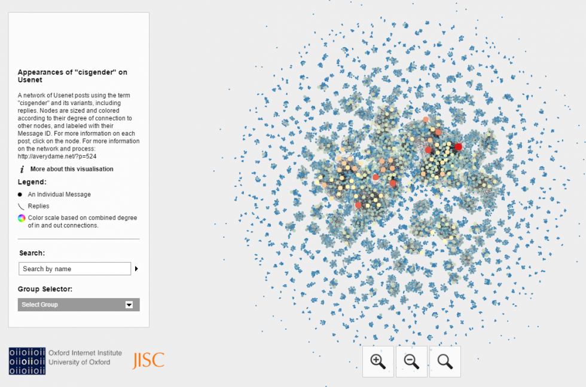

_This is the second in [series of blog posts](http://mith.umd.edu/tag/transgender-usenet-archive/) by 2016-17 Winnemore Digital Dissertation Fellow Avery Dame on the progress of his dissertation, “[Talk Amongst Yourselves: Community Formation in Transgender Counterpublic Discourse Online](http://mith.umd.edu/?p=18022),” which explores the affective and structural meanings assigned to “community” in English-language transgender discourse online._

One of the biggest challenges of working with Usenet Collections is their sheer size. For my five newsgroup collections, the average message count is between roughly 50,000 to 100,000 per collection. (To place that in context to recent news stories, presidential candidate HIllary Clinton’s private email server held [62,320 total emails](http://www.factcheck.org/2016/07/a-guide-to-clintons-emails/).) Though it’s not too sizable in storage terms (all five collections add up to about 1 GB total), it’s definitely a lot of data for a close discourse analysis. Complicating the process further is that many of the messages held in these collections also aren’t relevant to my specific research questions. That’s also a lot of information to hold in a single location, particularly as an archive. Unlike the [anonymous “generous donor”](https://archive.org/details/usenethistorical) who initially collected all of the various newsgroup messages, I’ll be making deliberate, intentional choices regarding what to include, how to present the messages, and what information should be indexed. Given this, I’ve moved to using the term “collections” to describe the data as it is now.

I’ve also been slowing my pace a bit in order to think carefully about what the archive might look like. Recently, I’ve focused my energy on spending a lot of time with the data, in order to get a better sense of how it should be structured, the technical challenges I might face, and what ethical questions I should consider. Part of this process has been doing a lot of scraping, counting, and visualizing, in order to put my numbers in (some) perspective. Now, these aren’t perfect tools, but I have been able to identify the active posters, cross-posting habits, and a rough network of posts using “cisgender” and variants of the term.

I’ve put [all of these visualizations up on my site](http://averydame.net/?page_id=495), with some description about their significance and my collection methodology (with links to the modules on [GitHub](https://github.com/apdame/usenet-tools)). From these exercises, I’ve learned that these newsgroups were similar to non-transgender newsgroups in poster activity, with a small handful of highly active posters who make up a sizable chunk of the messages collected. Users primarily posted to one or two newsgroups at a time, and there are some interesting differences in both what's recorded in the collections and how users cross-posted. There’s not a lot of crossposting between the two newsgroups with “transgendered” in the name, alt.transgendered (AltT) and soc.support.transgendered (SST), but there is a lot of cross-posting between SST and alt.support.srs (SRS). In contrast, the two major crossdressing groups, alt.fashion.crossdressing (AFCD) and alt.support.crossdressing (ASCD) have almost equal patterns of single newsgroup posting and cross-posting between themselves. These differences raise interesting questions I hope to address in a close analysis using the archive, once it’s launched in the next few weeks.

However, I also wanted to spend a little more time talking about [my initial network analysis](http://averydame.net/network/#), because I think it’s indicative of some of complexities of working with Usenet data. One of my key research questions is how Usenet facilitated the spread of the term “cisgender.” As far as I’ve found, the term or its variants don’t appear in movement publications during the 1990s. However, it eventually became ubiquitous in transgender discourse. How could that be, if it wasn’t in active use in print publications? This takes me to the internet, the other major (recorded) hub of transgender discussion at the time.

The term’s origins are unclear, and its corresponding Wikipedia (the unofficial arbiter of its history) reflects this lack of clarity. The page [did at one point cite](https://en.wikipedia.org/w/index.php?title=Cisgender&oldid=83262833) two Usenet users, Carl Bujis posting in soc.support.transgendered in 1996 and Dana Leland Defosse, posting in alt.transgendered in 1994, as separately originating the term.1 However, [the validity of these claims were challenged](https://en.wikipedia.org/wiki/Talk:Cisgender/Archive_1) as not being from “reliable sources” and subsequently removed. Usenet connections are made elsewhere as well: In the official Oxford English Dictionary (OED) definition, [the earliest use example cited is from Usenet](http://www.oed.com.proxy-um.researchport.umd.edu/view/Entry/35015487?redirectedFrom=cisgender#eid). For my research, I’m not particularly interested in finding a definitive origin point, but I am curious about what might have facilitated the sudden increase in use.

This leads me back to Usenet. [As I noted in my post contextualizing Usenet](http://averydame.net/?p=518), part of why spam was such an issue was how (relatively) easy it was to post and cross-post to multiple groups. This meant posts could spread widely and possibly be seen by a sizeable audience. Curious about how widespread the term was in the collected I collected information on all posts (identified by their unique Message ID) that used the term and its variants (cisgendered, cis-gender, cis-gendered, and cis), and the posts referenced in the “References” header (or previous posts in the conversation).2 The References header is by no means a perfect tool, though. According to [the documentation](https://tools.ietf.org/html/rfc1036), the References header in Usenet messages was supposed to “allow messages to be grouped into conversations by the user interface program.” However, programs were required to include only “a reasonable number of backwards references” if the list got too long. Thus, not all of a conversation was recorded in the header. Furthermore, some messages weren’t collected at the poster’s request, so their trace exists in a unique Message ID with no data.

Nevertheless, [the network I built](http://averydame.net/network/#) (visualized using the OpenOrd layout) gives you an idea of the amount, activity level, and connections between posts. Each node is a unique posting. Nodes are sized and colored according to their degree of connection to other nodes, and labeled using their Message ID. Posts with just a Message ID and no extra information (original/reply, year, etc.) were not held in any of the collections.

What does this show? Firstly, that the term appeared frequently on Usenet in several venues: ASCD and SST. I’ve specifically chosen appeared instead of “used” because Usenet posters often quoted each other using big chunks of one another’s text. So, a term could appear in many posts, but only in quotes and not by the individual poster. So the term gains visibility even if it isn’t adopted by others. Furthermore, big numbers don’t always equal long threads (as far as the collections show). While several posts sparked a high level of conversation (large nodes), most were short threads or single responses. Lastly, activity is date-limited: The vast majority of post activity occurs between 1996-2006—right around when social media platforms like Myspace and Facebook really begin to take off. Most surprising to me, however, was the high incidence of posts in crossdressing groups. What little literature that exists on trans Usenet focuses on AltT and SST as the “big two” of Usenet, but AFCD and ASCD were active and influential in their own right. In ASCD in particular cisgender and variants appear the most, even though the group isn’t mentioned in the print archives as a major hub of discussion.

In multiple ways, then, making this network challenged either popular received knowledge about “cisgender” or my own assumptions about what trans Usenet looked like. The numbers can’t tell the whole story, though. Understanding how these posts connect to each other requires a close discourse analysis of individual posts and the connections I’ve visualized here. Otherwise, it’s just a bunch of nodes on a graph: attractive to look at, but not meaningful in any particular way. Instead, this kind of project requires meeting big data with a fine-grained attention for detail that attempts to get at the content of discussions, in order to give those “big data” numbers meaning and context.

---

1 My data collection actually raises questions about the received narrative for who “first” uses “cisgender.” In 1994, 5 months after Defosse posts, another user posts in the same newsgroup about “cis-gendered, narrow-minded people,” with no clarification as to what the term means.

2 Prior to collecting my data, I also checked each message’s content against an automatically generated list of possible common misspellings. However, this process produced no hits.