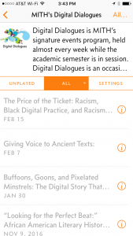

Since 2005 MITH's [Digital Dialogues](http://mith.umd.edu/digital-dialogues/) series has served as our signature events program, where we invite members of the digital humanities community to join us to talk about their work. From the beginning it was important for these discussions to serve not just our local community here at the University of Maryland, but also for them to be available to a growing number of scholars interested in the humanities and digital media. As David Durden [discussed](http://mith.umd.edu/decade-digital-dialogues-event-recordings-challenges-implementing-retroactive-digital-asset-management-plan/) [previously](http://mith.umd.edu/the-digital-dialogues-collection-chronicling/) in his posts about curating this collection, Digital Dialogues originally started as an audio podcast, and later migrated to a video format, that we now make available on Vimeo.

A couple years ago our friend Raymond Yee tweeted to us:

https://twitter.com/rdhyee/status/583734210357141504

While we do have an [RSS feed for the MITH website](http://mith.umd.edu/feed/) we don't actually have a dedicated podcast for Digital Dialogues. Unfortunately a podcast isn't something that Vimeo offers. Sadly it's often not in the interests of social media companies to let you leave their websites and apps to view content. Nevertheless, Raymond is among the 21% of Americans who still actively listen to podcasts--and according to [Edison Research](http://www.edisonresearch.com/the-infinite-dial-2016/) the numbers are growing.

So, while we're not getting rid of the video channel we decided to bring back the Digital Dialogues podcast:

<http://mith.umd.edu/digital-dialogues/podcast/>

Drop that URL in your podcast player or head on [over to the Apple Store](itms://itunes.apple.com/us/podcast/miths-digital-dialogues/id1200528741?mt=2):

Registering the podcast with Apple had the handy side effect of pushing it out into the [wider podcast ecosystem](https://itunespartner.apple.com/en/podcasts/partnersearch), so podcast players like [Overcast ](https://overcast.fm/)should be able to find it.

We considered modifying our WordPress site to add the video enclosure to our existing RSS feed, but decided instead to make the podcast part of our already existing workflow. Calling it a workflow is really another way of saying that a program runs from cron every day looking for new Digital Dialogue events that have an embedded Vimeo video; if a new one is found the video is downloaded (with [youtube-dl](https://rg3.github.io/youtube-dl/)), the audio is extracted (with [ffmpeg](http://ffmpeg.org/)) and then it's published on Amazon S3 (with [boto](https://github.com/boto/boto)). You can see this program over in the [mithcast repository](https://github.com/umd-mith/mithcast) on GitHub if you are interested.

We do hope you enjoy the Digital Dialogues on your commute, on your jog, or wherever they may find you. We're just sorry it took two years Raymond!