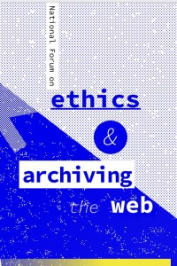

MITH is very excited to announce our participation in the [Ethics and Archiving the Web National Forum](https://eaw.rhizome.org) which will be taking place at the New Museum in New York City, March 22-24. This collaboration between [Rhizome](https://rhizome.org/) and the [Documenting the Now](http://www.docnow.io/) project will bring together activists, librarians, journalists, archivists, scholars, developers, and designers who are interested in generative conversations around the ethical use of the web in archives and memory work. If this sounds relevant to you please [register](https://buy.acmeticketing.com/orders/177/tickets?eventId=5a7d2b1c79e71d74ef421dca&date=2018-03-22T00:00:00-0400&cart) today while spots are still available. In addition to the program of panels and talks there will also be a series of workshops on the Saturday following the main event. Continue below the fold for a bit more context on why this event is important to MITH’s work here at UMD.

For the past two years our work with [our](https://library.ucr.edu/) [partners](https://library.wustl.edu/) on Documenting the Now has deepened MITH’s longstanding interest in how archives are assembled and studied as an integral part of digital humanities research. Much of MITH's previous attention in this area has focused on the construction of archives _in the web_--or rather, using the web as a means for publishing for, and engaging with, particular audiences of humanities scholars. As part of our efforts to help document the [Ferguson Protests](https://en.wikipedia.org/wiki/Ferguson_unrest), [Baltimore Uprising](https://en.wikipedia.org/wiki/2015_Baltimore_protests), and the [Black Lives Matter](https://en.wikipedia.org/wiki/Black_Lives_Matter) movement, we have been drawn into conversations about how to build archives _of the web_, specifically of social media content such as Twitter. This engagement has led us directly into conversations about the _positionality_ of archival work, and how ethics and our own values get built into collections and applications.

Thanks to the efforts of [Bergis Jules](https://twitter.com/BergisJules) and [Vernon Mitchell](https://twitter.com/vcmitchelljr) (the projects’ two co-PIs) we have had the opportunity to [engage with](http://www.docnow.io/meetings/stl-2016/) and [learn from](http://www.docnow.io/meetings/stl-2017/) activists in Ferguson on several occasions. These activists described how they used social media as part of their work in Ferguson, and how social media records fit into their lived experience, not just as protestors, but as citizens and people. Most importantly these activists, along with an assembled group of scholars, helped us think together about what it means to do memory work as activists, archivists and social media researchers. It is not simply good enough for our project to document the events in Ferguson without engaging with and giving back to the communities we are documenting. While methods such as [participant observation](https://en.wikipedia.org/wiki/Participant_observation) and [action research](https://en.wikipedia.org/wiki/Action_research) are helpful guides, there is still much work to be done in applying them as humanists and archivists to communities on the web.

The web has often been thought of as a shared public space, or as Lawrence Lessig [described it](https://cyber.harvard.edu/works/lessig/Fordham.pdf) in 1999, a _commons_:

> The internet is a commons: the space that anyone can enter, and take what she finds without the permission of a librarian, or a promise to pay. The net is built on a commons — the code of the World Wide Web, HTML, is a computer language that lays itself open for anyone to see — to see, and to steal, and to use as one wants. If you like a web page, then all major browsers permit you to reveal its source, download it, and change it as you wish. It’s out there for the taking; and what you take leaves as much for me as there was before.

It is astonishing how much has changed in how we think about the web since Lessig wrote those words almost 20 years ago. Far from being simply a commons that we can all take from equally, the web is now an unevenly distributed sociotechnical space, and an essential part of contemporary life. Web content exists along continuums of access and privilege, instead of in a binary, public/private state. Social media platforms are perfect examples of how communities can form in pockets the web. These communities aren’t simply part of a public commons or locked up in corporate walled gardens. We identified a real concrete need for more conversation and shared practices of how to work as scholars and archivists in an ethical, participatory way, while respecting the agency of the web communities we are attempting to remember.

With this goal in mind we invite you to join us in New York City at the Ethics and Archiving the Web forum. While the program is fixed, there are some spots available during the day long workshops if you would like to share your own work or projects with us. We hope to see you there!

Please get in touch with [Ed Summers](mailto:edsu@umd.edu) at MITH with any questions about the Documenting the Now project, or MITH's involvement in the forum.
