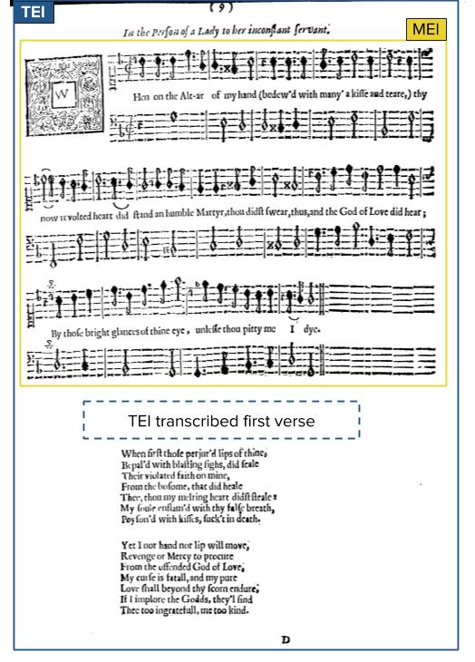

[Early Modern Songscapes](http://songscapes.org) is a project exploring the circulation and performance of English Renaissance poetry. The recently released beta version of the project’s site includes a digital exploration of Henry Lawes’s 1653 songbook _Ayres and Dialogues_. The project is a collaboration between the University of Toronto (UoT), the University of Maryland (UMD), and the University of South Carolina (USC). My role (Raff Viglianti) at MITH for this first exploratory phase has focused on designing a data model and an online viewer for the text and musical score of the songs. Prof. Scott Trudell (UMD) and Prof. Sarah Williams (USC) have contributed to shaping the data model and have carried out the encoding work so far.

__

The scholarship surrounding Lawes’s book and Early Modern song is at the nexus of literature and music and pays careful attention to both the literary and musical aspects of the songs. To reflect this duality in the data model of a digital edition, we use the [Text Encoding Initiative](http://www.tei-c.org/) (TEI) format for the verse and the [Music Encoding Initiative](http://music-encoding.org/) (MEI) format for the notated music. You can find our encoded files on [GitHub](https://github.com/earlymodernsongscapes/songscapes). Combining the two formats is becoming a fairly established practice (see for example the [Thesaurus Musicarum Latinarum](http://www.chmtl.indiana.edu/tml/about/introduction)), but is not without challenges as existing tools and workflows are usually focused on either TEI or MEI. The hierarchical nature of these formats also requires one of the two to contain the other or, in other words, take a primary position. We have decide to prioritize TEI, partly because it has a well established metadata header in which we store bibliographical information. The MEI representing the music notation is then embedded within the TEI (see Fig. 1). We have decided to reproduce the underlying lyrics as a TEI-encoded stanza in order to provide our interpretation of how it may appear if formatted as subsequent stanzas often printed after the music.

For some songs, we are also dealing with multiple versions from other sources with or without music. In these cases, we produce a _variorum edition_, or a presentation of the text that showcases differences across the sources without privileging one over the other. Both TEI and MEI are well equipped formats for modeling textual variance, but both assume that one text will be the main reading text and only variant text will be encoded from other sources. To overcome this apparent limitation, we create a separate TEI/MEI document that only represents a collation; in other words, a document that lists where the differences between the sources of one song are to be located. This allows us to encode each source separately and to the degree of detail that we deem appropriate without worrying about tessellating multiple sources in one place (see Fig. 2). This approach has proven quite effective and I have had the opportunity to apply it to other projects at MITH and beyond, such as [Digital Mishnah](https://mith.umd.edu/research/digital-mishnah/) and the [Frankenstein Variorum](https://pghfrankenstein.github.io/Pittsburgh_Frankenstein/) edition where, together with colleagues at Pittsburgh University and CMU, particularly Prof. Elisa Beshero-Bondar, we have begun to further develop, contextualize, and generalize this approach.

One goal of the Early Modern Songscapes project is to capture song as a multidimensional form, so we are complementing the edition with recorded performances of the songs, including variant version, under the direction of Prof. Katherine Larson (UoT). The musicians are Rebecca Claborn (mezzo-soprano), Lawrence Wiliford (tenor), and Lucas Harris (lute).

The UoT Scarborough Digital Scholarship Unit, under the direction of Marcus Barnes, has provided the backbone for the project through a robust implementation of [Fedora](https://duraspace.org/fedora/) for storing the Songscapes data and [Islandora](https://islandora.ca/) for the project website. My focus has been on providing a lightweight viewer for displaying the TEI, MEI, and adding interactivity for exploring variant readings and sources. The viewer is written in React/Redux and uses [CETEIcean](https://github.com/TEIC/CETEIcean) for rendering the TEI and [Verovio](http://verovio.org/) for rendering MEI. Both of these tools offer a solution for rendering these data directly in a user’s browser, thus reducing the need for server-side infrastructure for TEI and MEI publications. They also provide isomorphic (that is one-to-one) renderings of the data, which allows to manipulate the rendering as if it were the actual underlying data. This, for example, makes it somewhat simple to write code to follow references from collation documents to the sources according to the _variorum edition_ model described above. You can read more on CETEIcean in [Cayless & Viglianti 2018](https://www.balisage.net/Proceedings/vol21/html/Cayless01/BalisageVol21-Cayless01.html) and on Verovio in [Pugin 2106](https://github.com/Edirom/Festschrift-Veit/releases/download/v1.1/Festschrift-Veit_1.1.pdf) (pages 617-631).

The first phase of Early Modern Songscapes has culminated with [a conference](https://crrs.ca/event/early-modern-songscapes-2019/) at the University of Toronto, February 8-9 2019. As we plan the next phase, we are gathering user feedback on the site: we invite you to visit [songscapes.org](http://songscapes.org) and fill in our [survey](https://www.surveymonkey.com/r/songscapes)!

__