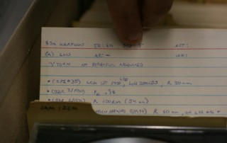
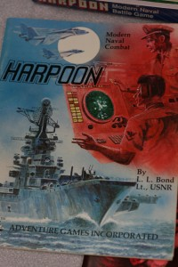

Preserving Virtual Worlds 2 is an ongoing project funded by the IMLS that builds on the work of Preserving Virtual Worlds. Rachel Donahue, doctoral student at the University of Maryland iSchool and research assistant at MITH, recently [wrote a post](http://mith.umd.edu/videogames-as-objects-of-cultural-preservation/) outlining the work of PVW2. As Donahue states, PVW2 focuses on "what exactly accessing a videogame "meaningfully" entails."

Within the diverse group of research partners, which also includes University of Illinois at Urbana-Champaign and Rochester Institute of Technology, the University of Maryland and Stanford University have partnered to review _Harpoon_, one of PVW2's several case studies. (Other case studies include _Super Mario Bros_., _Oregon Trail_, _Civilization_, _Typing of the Dead_). PVW2 has a special emphasis on educational or so-called "serious" games. This is where _Harpoon_ comes in: originally created by [Larry Bond](http://www.larry-bond.com/) for training naval officers, _Harpoon_ first appeared as a pen and paper tabletop game in 1981; the first version of the computer game was issued eight years later. (Along the way Chris Carlson also joined Bond as a co-designer). In addition to writing games, Bond, a former naval officer, also writes novels. Interestingly enough, Bond got his start working with Tom Clancy; in turn, several of Clancy's best-selling novels are partly based on playing _Harpoon_. Last week, amidst the crisp covers of _Harpoon_ game boxes, displaying submarines and smartly dressed officers peering through their Aviators, Henry Lowood from Stanford University, and Matthew Kirschenbaum and Rachel Donahue from the University of Maryland, combed through boxes of meticulous documentation Bond has loaned to MITH. Henry Lowood, Curator for History of Science & Technology Collections and Film & Media Collections in the Stanford Libraries, and creator of [_How They Got Game_](http://www.stanford.edu/group/htgg/cgi-bin/drupal/) explains, "most of the documentation that archives have collected up until now has focused on high-level design documentation, which does not end up being what the game actually is."  Matthew Kirschenbaum, Associate Director of MITH and a co-principal investigator on the project comments, "_Harpoon_ is a fascinating case study to work on and Larry Bond's been a terrific help in lending his personal records. It's a game that has had a long history in both tabletop and computer formats, has both a recreational hobbyist following as well as a professional application, and has been used as a tool for plotting best-selling novels. It is without question a significant artifact of its era."

Even though the research of PVW2 is currently from the point of view of game creator, the player perspective equally factors into the research, especially given the researchers also consider themselves players. Lowood explains, "If we bias the way we're assembling the collection towards one group or another, we bias the research. By taking into account all of these views, we develop several approaches to the collection."

While the preservation process of digital games up to now has been mostly ad-hoc, currently there is a huge interest among libraries to build an archive of digital games. By asking what the artifact is, and what aspects of the game must be documented, PVW2 is coming up with a set of best practices for the preservation of digital games for those institutions that seek to archive and collect these significant digital materials.

If PVW is categorized as focusing on technical and legal questions, PVW2 may be seen as more theoretical. "We're trying to get towards the significant aspects of these objects we are preserving, that a repository can monitor, to ensure that the project is saving something worthwhile," Lowood says. "We're stepping back, and asking, what needs to be in this archive of data? And what instructions need to be appended to the data?" 