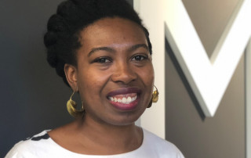

We are delighted to announce three additions to our team this fall. These new hires will contribute to MITH's research, teaching, and public programming in the areas of African American digital humanities and the performing arts.

Dr. Aleia Brown has been appointed as the new Assistant Director for the African American History, Culture, and Digital Humanities (AADHum) initiative. Aleia is our first appointment following [the award this summer](https://today.umd.edu/articles/mellon-foundation-awards-28m-research-digitization-humanities-3149b8cd-34a5-4a21-af14-2a9c34ef8c2b) of a three-year \$2 million grant from The Andrew W. Mellon Foundation to support the growth of AADHum. Most recently, Aleia served as Program Manager at Humanities Action Lab and a Mellon/American Council of Learned Society Public Fellow at Rutgers University—Newark. In that role she oversaw _Climates of Inequality: Stories of Environmental Justice_, an international initiative that engages students, faculty, and advocates in 23 cities to produce a traveling exhibition, programming, and digital platform. Prior to this, Aleia served as Visiting Curator of African and African American History and Culture at the Michigan State University Museum where she worked on a multi-year acquisition project and curated the Dr. Carolyn Mazloomi-Women of Color Quilters Network collection. Her current research project draws on oral history, material culture analysis, and undercommons as archives—traveling through the segregated south to urban cultural hubs to examine the life and work of Black women creating on the fringes of the Black arts movement.

As AADHum's Assistant Director, Aleia will serve as a member of the AADHum leadership team and contribute to strategic planning, leadership, and administration of AADHum with a particular focus AADHum's pedagogical agenda.

Dr. Susan Wiesner has been appointed as Principal Faculty Specialist for the Performing Arts. Susan comes to MITH following an appointment at the University of Maryland Libraries as Digital Humanist in Residence at the [Michelle Smith Performing Arts Library](https://www.lib.umd.edu/mspal). Her ongoing project, ARTeFACT, has been presented at several academic conferences (both Dance and Digital Humanities), been awarded an NEH Start-up Grant, and has been featured in book chapters and journal articles. She has conducted research into metadata and the development of ontologies for the performing arts using digital humanities methodologies and has developed a database of dance publications. A choreographer and dancer, Susan has presented her work in both the US and the UK, written as a dance critic, and taught at several universities. Her current research focuses on movement and notation systems as a means of machine learning and transfer of data between artistic forms.

At MITH, Susan will develop and manage projects focusing on the performing arts and teach a course on the digital humanities and embodied knowledge.

T'Sey-Haye Preaster is already a core member of the MITH team in her role as Graduate Assistant and Project Coordinator for the [Documenting the Now](https://www.docnow.io/) project. We're delighted that T'Sey-Haye will now join MITH in a full-time capacity. Her new appointment as Project Manager, Research Initiatives encompasses both her work on Documenting the Now, which will continue, and significant responsibilities as the Program Manager for AADHum. A PhD Candidate in the Department of American Studies, T'Sey-Haye examines the histories and lived experiences of Black women working strategically to (re)define the meaning and mission of philanthropy (e.g., gifts of time, talent, treasure and testimony) for/by Black communities in the United States. Prior to graduate school, T’Sey-Haye served for nearly a decade in community philanthropy as a program assistant for The Rhode Island Community Foundation where she worked on statewide grant-making initiatives and community advocacy campaigns for affordable housing, women and girls, LGBTQ equity, nonprofit excellence and Black philanthropy.

MITH is tremendously excited to welcome these scholars to the team!