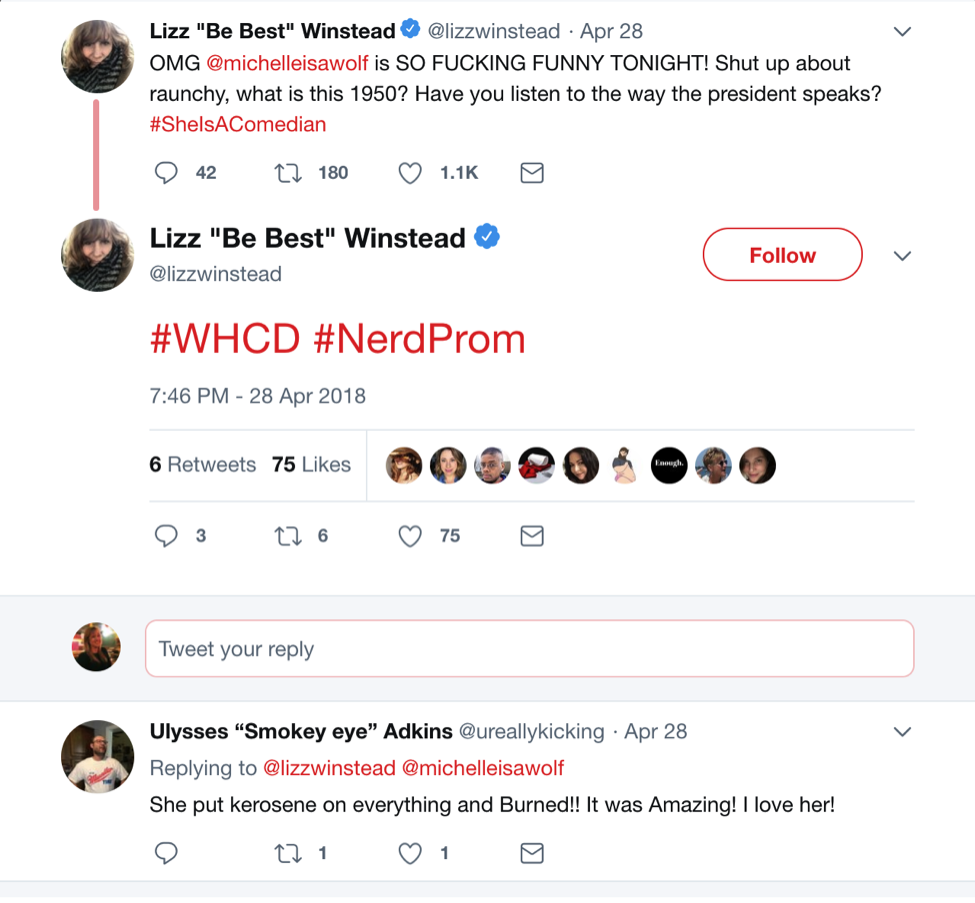

_This post is part 3 in a series about social media data collection experiments conducted in [Matt Kirschenbaum](https://twitter.com/mkirschenbaum)'s [Introduction to Digital Studies](https://dsah.umd.edu/requirements/#introds). Please see parts [1](https://mith.umd.edu/little-big-data/) and [2](https://mith.umd.edu/little-big-data/) for more context._

---

**Why**

For this project, I chose to explore the reactionary responses to comedian Michelle Wolf's performance at the 2018 White House Correspondents’ Dinner. The host's role at the annual Correspondents’ Dinner is difficult in that it requires striking a balance of tone -- how to roast the journalists and politicians in the room, and appeal to a wider audience, as the performance is streamed live? Wolf's job was particularly difficult, given the fact that the current president does not attend the dinners, and has routinely skewered journalists online in countless offensive and incendiary Twitter rants. Wolf, then, was faced with the same choice that all citizens face, but on a much more visible platform: to treat the administration lightly, and fall complicit in inaction, or to call out the horrors of the administration and face the attendant outrage machine. Wolf chose the latter, and, as has become the norm lately, Twitter became the outrage machine's medium (or even, weapon) of choice. Why do some Twitter users use direct address - tweeting at someone, in this case, Wolf - as part of their expression of outrage? Why is this particular address used?

**How**

I gathered two data sets in an attempt to track the reaction time of the outrage machine. I set the parameters of my twarc search to include only tweets sent to Michelle Wolf's account (@michelleisawolf) that included #WHCD in the message. My first set was for the time window of April 28th, the day of the dinner, to April 29th , and my second set was from April 28th to April 30th. The first set included only four tweets, all of which expressed excitement and enthusiasm. The second set is considerably more expansive, including 3,285 tweets. For the purposes of this exercise, my data story will consider the more generative results from the longer, second time frame. My goal in designing the search this way was to explore the ways in which those on Twitter utilized the direct address of tweeting at Michelle Wolf to express their opinions - be they positive or negative - about her remarks. How does the direct address change the reactionary politics of Twitter? And what do I gain as a researcher in utilizing search parameters that do not engage with the nuances of subtweeting?

**What**

The data set poses questions about user languages, verified accounts, and the hijacking of hashtags. First, in regards to languages, while English is the predominant language in the data set, 104 tweets were grouped in the "und" category. "und" is not on the list of Twitter verified languages. It can be implied that "und" denotes an "unidentified" language, though even this is unclear. This data would lead one to assume that accounts writing tweets in an "und" language are bots, but upon pulling up an "und" tweet, the tweet itself is in legible English, voicing support for Michelle Wolf and adding a #NerdProm hashtag to complement the #WHCD. The tweet is by co-creator of the Daily Show, Lizz Winstead's, verified account.

It's unclear how Twitter determines that an account is using an "und" or unidentified language, and this practice may be, to invoke [Safiya Noble](https://twitter.com/safiyanoble)'s work in [Algorithms of Oppression](http://algorithmsofoppression.com/), technologically redlining some accounts that do not use standard or easily identifiable registers of language. In terms of verified accounts, the data set notes that only 21 accounts, or .6%, of the tweets came from verified accounts. Continuing to explore Lizz Winstead's tweet, the original tweet itself is not a part of the data set, but the six retweets are included in the set. None of the six users who retweeted Lizz Winstead are listed as verified, despite the fact that the original tweet came from a verified source. How does this change the way we examine information, ideas, or phrases that circulate? Does the fact that the tweet came from a verified source change the way it is read as part of a tweet by an unverified user? What work has been done about the potential to weaponize the verification tool to further technologically redline individuals from marginalized communities?

Finally, I want to consider how the data set tools are inherently incomplete due to the fact that it is difficult to capture or collect tweets that are "subtweets," or that are clearly about an event, but do not reference the event hashtags or do not include any clear links to the subject of the tweet. For example, the tweet below by _New York Times_ journalist Maggie Haberman is clearly about the jokes Wolf made at the White House Correspondents’ Dinner, yet it does not contain any hashtags, any reference to a dinner, or any clear identifier beyond her inclusion of Sarah Huckabee Sanders' Twitter handle. Additionally, Haberman misreads Wolf's joke, even referring to the piece of the performance as "criticism." Yes, a performance can be criticism, but Haberman's tweet dangerously misinterprets Wolf's joke. How can we cast a wider net in collecting data sets to ensure that information such as Haberman's tweet is not lost? Haberman's was one of the most consistently referenced tweets about Wolf's performance, so much so that Wolf herself replied. How can data sets be used more expansively to capture a bigger picture of the events chronicled on Twitter? I wonder if tools like sentiment analysis could be used on a wide batch of tweets within a certain time frame to sort through possible subtweets, and more specific data sets could be useful for more pointed, specific analyses.

Exploring the data set raised more questions than it answered, and I wonder how useful data sets are in terms of capturing the nuance of any given cultural event or text. Why use data sets to explore nuance? To gather the numbers to complement a particular, nuanced argument? To provide evidence of technological redlining, of the gaps that exist that nuanced critique needs to fill? While I have no clear argument regarding the reactionary Twitter politics of the White House Correspondents’ Dinner, I do have a greater suspicion about the way in which Twitter quantifies our emotionally-charged communications, and the ways in which this data itself can be hijacked similarly to the hijacking of hashtags.

_You can view the dataset this story was based on [at GitHub.](https://github.com/jeschollaert/datastory/)_