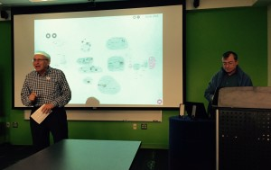

This spring, MITH worked with the National Endowment for the Humanities (NEH) and the University of Maryland Human-Computer Interaction Lab (HCIL) to bring renowned technology scholar Andy van Dam to campus for two successful events.

The first, on Monday April 25th, was a screening of a recently-unearthed 1974 documentary made at the end of an NEH-funded grant project van Dam and his team completed to use hypertext to aid in the teaching of poetry. The documentary was discovered after Brett Bobley and Ann Sneesby-Koch from the NEH completed a large-scale project to document all of NEH’s funding history. During that project they uncovered a punch card with details on the grant, which included a reference to a documentary film. Bobley contacted van Dam to enquire about the film, which was recovered and digitally transferred. MITH volunteered to coordinate a panel discussion and screening with van Dam, NEH staff, and UMD faculty members with relevant subject expertise.

[The film is now available on the Internet Archive for viewing here.](https://archive.org/details/AndyVanDamHypertextFilm)

[A recording of the panel discussion and screening is available on our website here.](http://mith.umd.edu/research/computer-science-and-the-humanities/)

A second event was held the following Tuesday, April 26, and was cosponsored by the HCIL. In this talk, van Dam discussed modern day collaborations between computing and the humanities in terms of new and old hypermedia projects over the course of five decades. Van Dam’s talk was preceded by a warm welcome by longtime scholarly collaborator and UMD Computer Science professor Ben Shneiderman, and was followed by a lively Q&A session.

[A recording of Andy’s talk is available here.](http://mith.umd.edu/dialogues/dd-spring-2016-andy-van-dam/)

Lastly, Jennifer Howard interviewed van Dam after his talk, and published a fantastic piece on his work and the 1974 grant project in _Humanities Magazine_. [Click here to access the piece](http://www.neh.gov/humanities/2016/spring/feature/computers-in-english-class-circa-1974).