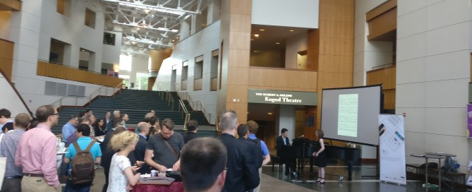

Raffaele Viglianti (MITH) and Stephen Henry (Michelle Smith Performing Arts Library) hosted the [Music Encoding Conference](http://music-encoding.org/conference/2018) last week (22 - 25 May 2018).

For the first time, the conference had a theme: “Encoding and Performance,” which was well represented throughout the program. We are especially grateful to **John Rink** for his keynote lecture-recital “_(Not) Beyond the Score: Decoding Musical Performance_,” which highlighted the challenges of encoding/decoding music notation through the lens of performance research and practice.

We are also particularly grateful to **Anna Kijas** who, in her keynote speech, “_What does the data tell us?: Representation, Canon, and Music Encoding_,” highlighted critical topics that are too often neglected in the music encoding community. Her talk made the fundamental point that our acts of building digital representations of notated music can (and currently do) reinforce traditional canons of music history that overlook contributions by women and people of color. In establishing a “digital canon” we have an unprecedented opportunity to change this. [Read the full text of her keynote on Medium](https://medium.com/@kijas/https-medium-com-kijas-what-does-the-data-tell-us-926ba830702f).

We closed MEC with a productive _unconference_ day in the MITH offices and we are happy to already see some activity on the Music Encoding Initiative community as a result!

Many thanks were given throughout the conference days; however, we would be remiss not to acknowledge again the support provided by the University of Maryland College of Arts and Humanities and the MEI Board for sponsored bursaries for students. This was especially important to allow students to attend the conference in a place that is currently geographically distant from the core constituencies of the MEI community. We are also thankful to Tido for sponsoring the Wednesday reception and particularly to soprano Tory Wood and Tido’s founder and director Brad Cohen for a wonderful live performance.

We enjoyed hosting our attendees at the beautiful Clarice Smith Performing Arts Center and are grateful to the wonderful team there: Leighann Yarwood, Amanda Lee Barber, Kara Warton, and their technical staff. Special thanks also to Lori Owen from the College of Arts and Humanities. We are also thankful for the students from the Performing Arts Library who manned the registration desk and helped with all odds and ends of the conference. They are: Jennifer Bonilla, Peter Franklin, Will Gray, Kimia Hesabi, Amarti Tasissa, Zachary Tumlin, Terriq White, and Barrett Wilbur.

Finally, we are thankful to all who submitted contributions to the conference and to the Program Committee: Karen Desmond (chair), Johanna Devaney, David Fiala, Andrew Hankinson, and Maja Hartwig.