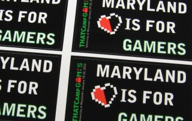

THATCamp Games, last weekend’s four-day unconference on digital humanities and gaming, had its origin in [a packed “humanities gaming” catch-all session](https://secure.flickr.com/photos/trevorandmarjee/5797536358/) at THATCamp Prime 2011, where we quickly realized that “games” was too broad a topic for a single session. THATCamp Games brought together members of the games industry, games researchers and designers, and games teachers to discuss games in as many genres (e.g. board games, alternate reality games, video games) and areas (e.g. games for teaching writing, game programming, and historical gaming) as possible. Almost one hundred people attended, coming from both the local DC/MD area and states across the country: Washington, California, New York, Connecticut, Pennsylvania, and Michigan, to name a few. Our first event was one of the first screenings of Lorien Green’s new documentary [_Going Cardboard_](https://web.archive.org/web/20180609170848/http://boardgamemovie.com/), a documentary about the players and designers in the burgeoning eurogaming scene; after the film showing, Green answered questions via Skype. Friday offered a full day of [fifteen workshops](http://thatcampgames.org/bootcamps/) ("Bootcamps") divided into three tracks: beginner-friendly introductions to game design (e.g. a “my first board game” prototyping session), a “hack track” for people with some previous game coding experience (e.g. HTML5, Inform 7, and the Kinect), and a track devoted to games in the classroom (e.g. alternate reality games and video games in the classroom). After the workshops, we headed over to MITH ([avoiding the grue](http://ow.ly/i/qiU7)) for a reception. Saturday started off menacingly: an overnight snowstorm left sheets of black ice between attendees and the conference. Most of the attendees and all of the coffee managed to make it to the conference building on time, however, and we cast our votes to narrow down almost forty attendee-proposed sessions to fit into five time slots in five rooms. (If you’re not familiar with [THATCamps](http://thatcamp.org/), attendees don’t present papers but instead write blog posts about topics they’d like to discuss, then facilitate sessions on those topics). You can see which sessions got placed on the schedule [here](http://thatcampgames.org/fullchedule/); these included discussions on [quest-based evaluation schemes](http://thatcampgames.org/2012/01/03/session-proposal-quest-based-evaluation-schemes/), teaching [games in the literature classroom](http://thatcampgames.org/2012/01/20/session-proposal-games-and-the-literature-classroom/), and [course game design using learning management systems](http://thatcampgames.org/2012/01/03/a-modest-session-proposal/). We ran a game lounge all-day on Saturday, but since most attendees were busy with sessions then, we also met for game-playing and a Glorious-Trainwrecks-style rapid-prototyping game design jam on Sunday morning. If you weren’t following the overwhelming volume of “[#thatcamp games](https://twitter.com/search?q=%23thatcamp%20games)” tweets last weekend, we’re happy to report that the event satisfied both unconference novices and THATCamp veterans, with assessments such as “a truly intellectually (and personally) meaningful event” and “THATCamp Games: totally awesome." Amidst the sessions, we ran an unconference-long alternate reality game, participated as a group in a spoken text adventure, logged onto an attendee-run Minecraft server, and thought really hard about the puzzle on the backs of the conference shirts. If you’re sad you missed the event, we’re collecting names of potential future attendees via a sidebar form on [thatcampgames.org](http://thatcampgames.org/). _[THATCamp Games](http://thatcampgames.org) was co-organized by MITH Webmaster [Amanda Visconti](http://www.literaturegeek.com/) and [Anastasia Salter](http://selfloud.net/). Follow us on Twitter via @thatcampgames or #thatcamp games. _