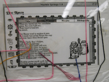

“We were interested in the collection as a research test bed and so we wanted a set of born-digital materials we could actually work with, that a student could work with…” MITH Associate Director Matt Kirschenbaum

When you come to visit _The Deena Larsen Collection (DLC)_, you will be shown five well organized glass cases, containing vintage Macintosh computers, archival storage boxes, books on hypertext and new media, and a smattering of old computer peripherals.

<!-- @font-face {   font-family: "Cambria"; }p.MsoNormal, li.MsoNormal, div.MsoNormal { margin: 0in 0in 0.0001pt; font-size: 12pt; font-family: Cambria; }div.Section1 { page: Section1; } -->

Your guide will likely also point out the famous “[Marble Springs Shower Curtain](http://mith.umd.edu/larsen/items/show/42)." The shower curtain attempts to graphically illustrate, with printed screen shots and colored thread, the linked associations enlivened by authoring a hypertextual work to an audience in the pre-Web browsers days of the early 1990s.

As Maryland Institute for Technology in the Humanities (MITH) Associate Director Matthew Kirschenbaum notes, _The Deena Larsen Collection_ is “a true hybrid collection,” containing both analog and digital materials. Besides the specimens mentioned above, there are e-literature works from numerous authors, sometimes in draft _and_ finished form, as Deena is a keen collaborator, always happy to “read” rough drafts. Larsen, Kirschenbaum remarks, is “also somebody who is broadly interested in computer culture.” The _DLC_ contains many newspaper and magazine articles and clipped comics on issues such as Internet privacy, the growth of email, law and the Internet, and the frustrations computing tools can bring to the average user, among others. “I think,” Kirschenbaum adds, “the collection has some value as a cross section of a certain moment in popular computer history as well from roughly 1985 to 2000.”

One great aspect of the _DLC_, is researchers are encouraged to dig into the collection’s many artifacts. “We offered to take \[_The Deena Larsen Collection_] here at Maryland,” Kirschenbaum explains, “with the understanding that we are not an archive, that we are not a unit of University Special Collections: We are a Digital Humanities Center. We were interested in the collection as a research test bed and so we wanted a set of born-digital materials we could actually work with, that a student could work with, and which also…were interesting.” In fact, while MITH is involved with a great number of [projects](http://mith.umd.edu/research/), _The Deena Larsen Collection_ is the only one actually housed on site, taking up physical space within the MITH offices.

With those things in mind I was encouraged to explore the collection.

I used the Finding Aid binder (more on the Finding Aid [next post](http://mith.umd.edu/hands-on-the-dlc-finding-and-finding-aids)) to see which Mac Classic or Mac SE was still running. Sadly, my first choice, a Mac Classic II identified as M1, had stopped working since it’s last check-up in May 2009, and the screen never resolved:

(In case you are wondering about the markings on the side, yes, Deena did buy a pallet of surplussed computers from the Denver Public School, which she stores in her temperature controlled crawl space (I have crawled in it)…but that is a story for another time.)

Fortunately, the Macintosh SE, labeled M2, booted right up. I was able to use the SE and the Finding Aid devoted to the 800+ 3.5 inch floppy disks (more on these next post) that are in the collection to locate disks devoted to _Marble Springs, Second Edition_, and look through various drafts.

(A brief aside: As I was working, I became aware of a creeping nostalgia. At first I could not figure out the cause. Then I realized it was the sound of the Mac SE working, with its characteristic grunts, and clunks, and whirs. If you would like a listen, play the attached sound file: [MS_MAC_SE.mp3 ](http://mith.umd.edu/wp-content/uploads/2014/02/MS_MAC_SE.mp3)or [MS_MAC_SE.m4v](http://mith.umd.edu/wp-content/uploads/2014/02/MS_MAC_SE.m4v), depending on your software. It lasts about 2 minutes.)

Some of the archivists out there might be cringing at this point: “They let him turn on a 20-year-old Macintosh and pop in disks? Are they crazy?!?” This concern was certainly at the center of planning for the _DLC._

“We have been entrusted with the material, and we take that seriously, and it is part of our mission to do right by it,” Kirschenbaum says. Of the Mac Classics he poses “one could ask are these artifacts first and foremost to be preserved? Are they tools? Are they instruments of access?”

For the _DLC_, the answer is a bit of all three. On a practical level, the _DLC \_does not have the resources to leave usable tools on the shelf. On the other hand MITH is seeking ways to work with University of Maryland [iSchool](http://ischool.umd.edu) faculty to utilize the \_DLC_ materials in archiving or preservation classes. Students, under the supervision of MITH staff, have been able to practice imaging disks using the _DLC_ disk collection.

“We have a lot of respect for the collection, we have a lot of affection for it, we do everything we can for it,” Kirschenbaum said warmly, “but we also see it as something to be used.”

Further, Kirschenbaum feels the MITH approach to _The Deena Larsen Collection_ is in keeping with Larsen’s own collaborative and supportive approach to the creation of e-literature.

“Our hope is there will be a modest number of researchers who will find their way here…every year,” he added.

So in the collaborative spirit, my next post will describe my adventures researching in _The Deena Larsen Collection_, in hopes of making your visit more productive.

**Up next: **_Hands on the DLC: Finding and Finding Aids_

\_\_\_\_\_\_\_\_\_\_\_\_\_\_\_\_\_\_\_\_\_\_\_\_\_\_\_\_\_\_\_\_\_\_\_\_\_\_\_\_\_\_\_\_\_\_\_\_\_\_\_\_\_\_\_\_\_\_\_\_\_\_\_\_\_\_\_\_\_\_\_\_\_\_\_\_

Want to schedule a visit to the _DLC_? Use the form at <http://mith.umd.edu/larsen/contact>

Citations:

Quotations from MITH Associate Director Matthew Kirschenbaum are from an interview with the author conducted April 15, 2011, at MITH, unless otherwise noted.

Image credits:

The_Deena_Larsen_Collection.png, Leighton Christiansen, April 14, 2011

MS1_shower_DocNancy.png, Leighton Christiansen, April 14, 2011

DLC_mac_classic_II_fail.png, Leighton Christiansen, April 14, 2011

DLC_Mac_SE.png, Leighton Christiansen, April 14, 2011

Audio:

MS_MAC_SE.mp3 and MS_MAC_SE.m4v, recorded at MITH, Leighton Christiansen, April 14, 2011

Leighton Christiansen is pursing his Master’s of Library and Information Science Degree at the Graduate School of Library and Information Science (GSLIS), at the University of Illinois at Urbana-Champaign, and threatens to catch that degree any time now.

You can reach him at leightonlc@gmail.com, or [@purpleleighton](https://twitter.com/purpleleighton) on Twitter